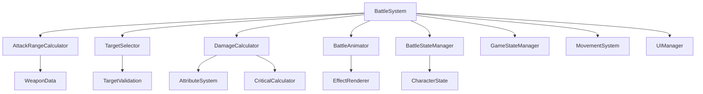

# 設計文書

## 概要

戦闘システムは、SRPGにおける攻撃・防御・ダメージ計算を管理する核心システムです。キャラクターの能力値、装備、位置関係、属性相性などを考慮した戦略的な戦闘体験を提供します。

## アーキテクチャ

### システム構成図



### データフロー

1. **攻撃開始**: プレイヤーがキャラクターを選択し攻撃アクションを選択
2. **範囲計算**: AttackRangeCalculatorが武器データに基づいて攻撃範囲を計算
3. **対象選択**: TargetSelectorが有効な攻撃対象を特定し、プレイヤーの選択を受付
4. **ダメージ計算**: DamageCalculatorが攻撃力、防御力、属性相性を考慮してダメージを算出
5. **アニメーション実行**: BattleAnimatorが攻撃・ダメージ・結果のアニメーションを再生
6. **状態更新**: BattleStateManagerがキャラクター状態とゲーム進行を更新

## コンポーネントと インターフェース

### BattleSystem（メインコントローラー）

```typescript
class BattleSystem {
  private attackRangeCalculator: AttackRangeCalculator;
  private targetSelector: TargetSelector;
  private damageCalculator: DamageCalculator;
  private battleAnimator: BattleAnimator;
  private battleStateManager: BattleStateManager;

  // 攻撃フローの開始
  initiateAttack(attacker: Unit): Promise<void>;

  // 攻撃範囲の表示
  showAttackRange(attacker: Unit): void;

  // 攻撃対象の選択
  selectTarget(target: Unit): Promise<BattleResult>;

  // 攻撃のキャンセル
  cancelAttack(): void;

  // 戦闘可能性の判定
  canAttack(attacker: Unit): boolean;
}
```

### AttackRangeCalculator（攻撃範囲計算）

```typescript
class AttackRangeCalculator {
  // 攻撃可能範囲の計算
  calculateAttackRange(attacker: Unit, weapon: Weapon): Position[];

  // 武器種別による範囲パターン
  getWeaponRangePattern(weaponType: WeaponType): RangePattern;

  // 障害物による攻撃阻害の判定
  isAttackBlocked(from: Position, to: Position): boolean;

  // 範囲攻撃の影響範囲計算
  calculateAreaOfEffect(center: Position, weapon: Weapon): Position[];
}
```

### TargetSelector（対象選択）

```typescript
class TargetSelector {
  // 攻撃可能対象の特定
  getValidTargets(attacker: Unit, range: Position[]): Unit[];

  // 対象選択の処理
  selectTarget(target: Unit): boolean;

  // 範囲攻撃対象の取得
  getAreaTargets(center: Position, weapon: Weapon): Unit[];

  // 対象選択のキャンセル
  clearSelection(): void;
}
```

### DamageCalculator（ダメージ計算）

```typescript
class DamageCalculator {
  // 基本ダメージ計算
  calculateBaseDamage(attacker: Unit, target: Unit, weapon: Weapon): number;

  // 属性相性の適用
  applyElementalModifier(damage: number, attackElement: Element, targetElement: Element): number;

  // クリティカルヒット判定
  calculateCritical(attacker: Unit, target: Unit): CriticalResult;

  // 回避判定
  calculateEvasion(attacker: Unit, target: Unit): boolean;

  // 最終ダメージの決定
  calculateFinalDamage(baseDamage: number, modifiers: DamageModifier[]): number;
}
```

### BattleAnimator（戦闘アニメーション）

```typescript
class BattleAnimator {
  // 攻撃アニメーションの再生
  playAttackAnimation(attacker: Unit, target: Unit, weapon: Weapon): Promise<void>;

  // ダメージエフェクトの表示
  showDamageEffect(target: Unit, damage: number, type: DamageType): Promise<void>;

  // HPバー更新アニメーション
  animateHPChange(unit: Unit, oldHP: number, newHP: number): Promise<void>;

  // 戦闘不能演出
  playDefeatedAnimation(unit: Unit): Promise<void>;

  // エフェクトのクリーンアップ
  clearBattleEffects(): void;
}
```

### BattleStateManager（戦闘状態管理）

```typescript
class BattleStateManager {
  // ダメージの適用
  applyDamage(target: Unit, damage: number): void;

  // 戦闘不能状態の処理
  handleUnitDefeated(unit: Unit): void;

  // 経験値の付与
  grantExperience(unit: Unit, amount: number): void;

  // 戦闘結果の記録
  recordBattleResult(result: BattleResult): void;

  // 戦闘後の状態更新
  updatePostBattle(): void;
}
```

## データモデル

### 戦闘関連の型定義

```typescript
interface BattleResult {
  attacker: Unit;
  target: Unit;
  damage: number;
  isCritical: boolean;
  isEvaded: boolean;
  experienceGained: number;
  targetDefeated: boolean;
}

interface DamageModifier {
  type: 'elemental' | 'critical' | 'terrain' | 'status';
  multiplier: number;
  description: string;
}

interface RangePattern {
  type: 'single' | 'line' | 'area' | 'cross' | 'custom';
  range: number;
  pattern: Position[];
}

interface CriticalResult {
  isCritical: boolean;
  multiplier: number;
  chance: number;
}

enum DamageType {
  PHYSICAL = 'physical',
  MAGICAL = 'magical',
  CRITICAL = 'critical',
  HEALING = 'healing',
}

enum Element {
  NONE = 'none',
  FIRE = 'fire',
  WATER = 'water',
  EARTH = 'earth',
  AIR = 'air',
  LIGHT = 'light',
  DARK = 'dark',
}
```

### 武器データ構造

```typescript
interface Weapon {
  id: string;
  name: string;
  type: WeaponType;
  attackPower: number;
  range: number;
  rangePattern: RangePattern;
  element: Element;
  criticalRate: number;
  accuracy: number;
  specialEffects: WeaponEffect[];
}

interface WeaponEffect {
  type: 'poison' | 'burn' | 'freeze' | 'stun';
  chance: number;
  duration: number;
  power: number;
}

enum WeaponType {
  SWORD = 'sword',
  BOW = 'bow',
  STAFF = 'staff',
  SPEAR = 'spear',
  AXE = 'axe',
  DAGGER = 'dagger',
}
```

## エラーハンドリング

### 戦闘エラーの種類

```typescript
enum BattleError {
  INVALID_ATTACKER = 'invalid_attacker',
  INVALID_TARGET = 'invalid_target',
  OUT_OF_RANGE = 'out_of_range',
  ALREADY_ACTED = 'already_acted',
  INSUFFICIENT_MP = 'insufficient_mp',
  WEAPON_BROKEN = 'weapon_broken',
  TARGET_UNREACHABLE = 'target_unreachable',
}

class BattleErrorHandler {
  handleError(error: BattleError, context: BattleContext): void;
  showErrorMessage(error: BattleError): void;
  recoverFromError(error: BattleError): void;
}
```

### エラー回復戦略

1. **無効な攻撃者**: 攻撃をキャンセルし、キャラクター選択に戻る
2. **無効な対象**: 対象選択をリセットし、範囲表示を継続
3. **射程外攻撃**: 有効な範囲を再表示し、ユーザーに通知
4. **行動済みキャラクター**: 攻撃を無効化し、次のキャラクターに移行
5. **MP不足**: スキル使用を無効化し、通常攻撃に切り替え

## テスト戦略

### ユニットテスト対象

1. **AttackRangeCalculator**: 武器種別ごとの範囲計算精度
2. **DamageCalculator**: ダメージ計算式の正確性
3. **TargetSelector**: 対象選択の妥当性検証
4. **BattleStateManager**: 状態変更の整合性確認

### 統合テスト対象

1. **戦闘フロー**: 攻撃開始から完了までの一連の流れ
2. **アニメーション連携**: 戦闘アニメーションとゲーム状態の同期
3. **エラーハンドリング**: 異常ケースでの適切な処理

### パフォーマンステスト

1. **範囲計算**: 大きなマップでの攻撃範囲計算時間
2. **アニメーション**: 複数キャラクターの同時戦闘処理
3. **メモリ使用量**: 戦闘エフェクトのメモリリーク検証

## セキュリティ考慮事項

### データ整合性

1. **ダメージ計算**: クライアントサイドでの計算結果検証
2. **状態変更**: 不正な状態変更の防止
3. **経験値付与**: 重複付与の防止

### チート対策

1. **攻撃範囲**: サーバーサイドでの範囲検証
2. **ダメージ値**: 計算結果の妥当性チェック
3. **キャラクター状態**: 状態変更の権限確認

この設計に基づいて、戦闘システムを段階的に実装し、SRPGとしての戦略性と楽しさを提供します。
