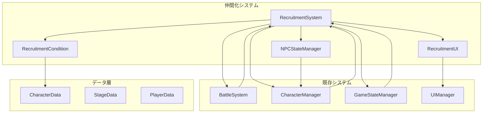

# 設計書

## 概要

仲間化システムは、敵キャラクターを特定条件下で撃破することで味方に引き込む「魔性の薔薇」SRPGの核心機能です。このシステムは戦闘システム、ターン制システム、キャラクター管理システムと密接に連携し、プレイヤーに戦略的な判断を求める深いゲームプレイを提供します。

## アーキテクチャ

### システム構成図



### データフロー

1. **初期化フェーズ**: ステージデータから仲間化可能キャラクターを識別
2. **戦闘フェーズ**: 攻撃時に仲間化条件をチェック
3. **NPC化フェーズ**: 条件達成時にキャラクターをNPC状態に変更
4. **保護フェーズ**: NPCを敵の最優先攻撃対象として設定
5. **完了フェーズ**: ステージクリア時に生存NPCを仲間として加入

## コンポーネントと インターフェース

### RecruitmentSystem（メインコントローラー）

```typescript
interface IRecruitmentSystem {
  // 初期化
  initialize(stageData: StageData): void;
  
  // 仲間化判定
  checkRecruitmentEligibility(attacker: Unit, target: Unit): RecruitmentResult;
  processRecruitmentAttempt(attacker: Unit, target: Unit, damage: number): boolean;
  
  // NPC管理
  convertToNPC(unit: Unit): void;
  getNPCUnits(): Unit[];
  
  // 仲間化完了
  completeRecruitment(): RecruitedUnit[];
  
  // UI連携
  getRecruitmentConditions(unit: Unit): RecruitmentCondition[];
  getRecruitmentProgress(unit: Unit): RecruitmentProgress;
}

class RecruitmentSystem implements IRecruitmentSystem {
  private npcStateManager: NPCStateManager;
  private recruitmentConditions: Map<string, RecruitmentCondition[]>;
  private npcUnits: Set<Unit>;
  private recruitmentUI: RecruitmentUI;
  
  constructor(
    battleSystem: BattleSystem,
    characterManager: CharacterManager,
    gameStateManager: GameStateManager
  ) {
    this.npcStateManager = new NPCStateManager();
    this.recruitmentConditions = new Map();
    this.npcUnits = new Set();
    this.recruitmentUI = new RecruitmentUI();
  }
}
```

### NPCStateManager（NPC状態管理）

```typescript
interface INPCStateManager {
  convertToNPC(unit: Unit): void;
  isNPC(unit: Unit): boolean;
  getNPCPriority(unit: Unit): number;
  handleNPCDamage(unit: Unit, damage: number): void;
  updateNPCVisuals(unit: Unit): void;
}

class NPCStateManager implements INPCStateManager {
  private npcUnits: Map<string, NPCState>;
  
  convertToNPC(unit: Unit): void {
    // キャラクターをNPC状態に変更
    // 行動不可状態に設定
    // 視覚的表示を更新
    // 敵AIの攻撃優先度を最高に設定
  }
  
  isNPC(unit: Unit): boolean {
    return this.npcUnits.has(unit.id);
  }
  
  getNPCPriority(unit: Unit): number {
    // NPCの場合は最高優先度を返す
    return this.isNPC(unit) ? Number.MAX_SAFE_INTEGER : 0;
  }
}
```

### RecruitmentCondition（仲間化条件）

```typescript
interface RecruitmentCondition {
  id: string;
  type: RecruitmentConditionType;
  description: string;
  parameters: Record<string, any>;
  checkCondition(context: RecruitmentContext): boolean;
}

enum RecruitmentConditionType {
  SPECIFIC_ATTACKER = 'specific_attacker',
  HP_THRESHOLD = 'hp_threshold',
  DAMAGE_TYPE = 'damage_type',
  TURN_LIMIT = 'turn_limit',
  ALLY_PRESENT = 'ally_present'
}

class SpecificAttackerCondition implements RecruitmentCondition {
  id: string;
  type = RecruitmentConditionType.SPECIFIC_ATTACKER;
  description: string;
  parameters: { attackerId: string };
  
  checkCondition(context: RecruitmentContext): boolean {
    return context.attacker.id === this.parameters.attackerId;
  }
}

class HPThresholdCondition implements RecruitmentCondition {
  id: string;
  type = RecruitmentConditionType.HP_THRESHOLD;
  description: string;
  parameters: { threshold: number };
  
  checkCondition(context: RecruitmentContext): boolean {
    const hpPercentage = context.target.currentHP / context.target.stats.maxHP;
    return hpPercentage <= this.parameters.threshold;
  }
}
```

### RecruitmentUI（UI管理）

```typescript
interface IRecruitmentUI {
  showRecruitmentConditions(unit: Unit, conditions: RecruitmentCondition[]): void;
  updateRecruitmentProgress(unit: Unit, progress: RecruitmentProgress): void;
  showNPCIndicator(unit: Unit): void;
  hideNPCIndicator(unit: Unit): void;
  showRecruitmentSuccess(unit: Unit): void;
  showRecruitmentFailure(unit: Unit, reason: string): void;
}

class RecruitmentUI implements IRecruitmentUI {
  private scene: Phaser.Scene;
  private conditionPanels: Map<string, Phaser.GameObjects.Container>;
  private npcIndicators: Map<string, Phaser.GameObjects.Sprite>;
  
  showRecruitmentConditions(unit: Unit, conditions: RecruitmentCondition[]): void {
    // 仲間化条件を表示するUIパネルを作成
    // 条件の達成状況を色分けで表示
    // プレイヤーが理解しやすい形で情報を提示
  }
  
  showNPCIndicator(unit: Unit): void {
    // NPC状態を示す視覚的インジケーターを表示
    // キャラクターの上に特別なアイコンを配置
    // 敵の攻撃対象であることを明確に示す
  }
}
```

## データモデル

### 仲間化データ構造

```typescript
interface RecruitableCharacter {
  characterId: string;
  conditions: RecruitmentCondition[];
  npcState?: NPCState;
  recruitmentStatus: RecruitmentStatus;
}

interface NPCState {
  convertedAt: number; // ターン数
  remainingHP: number;
  isProtected: boolean;
  visualState: NPCVisualState;
}

interface RecruitmentContext {
  attacker: Unit;
  target: Unit;
  damage: number;
  turn: number;
  stageData: StageData;
}

interface RecruitmentResult {
  success: boolean;
  conditionsMet: boolean[];
  nextAction: RecruitmentAction;
  message?: string;
}

enum RecruitmentStatus {
  AVAILABLE = 'available',
  CONDITIONS_MET = 'conditions_met',
  NPC_STATE = 'npc_state',
  RECRUITED = 'recruited',
  FAILED = 'failed'
}

enum RecruitmentAction {
  CONTINUE_BATTLE = 'continue_battle',
  CONVERT_TO_NPC = 'convert_to_npc',
  RECRUITMENT_SUCCESS = 'recruitment_success',
  RECRUITMENT_FAILED = 'recruitment_failed'
}
```

### JSONデータ構造

```json
{
  "recruitableCharacters": [
    {
      "characterId": "enemy_knight_01",
      "conditions": [
        {
          "id": "specific_attacker",
          "type": "specific_attacker",
          "description": "主人公で攻撃して撃破する",
          "parameters": {
            "attackerId": "protagonist"
          }
        },
        {
          "id": "hp_threshold",
          "type": "hp_threshold", 
          "description": "HPが30%以下の状態で撃破する",
          "parameters": {
            "threshold": 0.3
          }
        }
      ]
    }
  ]
}
```

## エラーハンドリング

### エラー分類

```typescript
enum RecruitmentError {
  INVALID_TARGET = 'invalid_target',
  CONDITIONS_NOT_MET = 'conditions_not_met',
  NPC_ALREADY_DEFEATED = 'npc_already_defeated',
  SYSTEM_ERROR = 'system_error'
}

class RecruitmentErrorHandler {
  handleError(error: RecruitmentError, context: RecruitmentContext): void {
    switch (error) {
      case RecruitmentError.INVALID_TARGET:
        this.showMessage("このキャラクターは仲間にできません");
        break;
      case RecruitmentError.CONDITIONS_NOT_MET:
        this.showMessage("仲間化条件を満たしていません");
        break;
      case RecruitmentError.NPC_ALREADY_DEFEATED:
        this.showMessage("仲間化に失敗しました");
        break;
    }
  }
}
```

## テスト戦略

### ユニットテスト対象

1. **RecruitmentSystem**: 仲間化判定ロジック
2. **NPCStateManager**: NPC状態管理
3. **RecruitmentCondition**: 各条件の判定ロジック
4. **RecruitmentUI**: UI表示・更新ロジック

### 統合テスト対象

1. **戦闘システム連携**: 攻撃→仲間化判定→NPC化の流れ
2. **AI連携**: NPCの攻撃優先度設定
3. **ステージクリア連携**: 生存NPC→仲間加入の流れ
4. **データ永続化**: 仲間化情報の保存・読み込み

### E2Eテスト対象

1. **完全な仲間化フロー**: 条件確認→攻撃→NPC化→保護→仲間加入
2. **仲間化失敗フロー**: NPC撃破→仲間化失敗
3. **複数NPC管理**: 複数キャラクターの同時NPC化
4. **UI/UX**: プレイヤーの理解しやすさ

## パフォーマンス考慮事項

### 最適化ポイント

1. **条件チェック**: 攻撃時の条件判定を効率化
2. **UI更新**: 必要時のみUI要素を更新
3. **メモリ管理**: NPC状態オブジェクトの適切な管理
4. **イベント処理**: 仲間化イベントの非同期処理

### メモリ使用量

- 仲間化条件データ: 1KB/キャラクター
- NPC状態データ: 500B/NPC
- UI要素: 2KB/表示中パネル
- 総使用量目標: 50KB以下（10体のNPC想定）

## セキュリティ考慮事項

### データ整合性

1. **条件検証**: 仲間化条件の妥当性チェック
2. **状態同期**: NPC状態とゲーム状態の整合性
3. **不正操作防止**: 条件を満たさない仲間化の防止
4. **データ検証**: 保存データの整合性確認

## 実装フェーズ

### フェーズ1: 基盤システム（1週間）

- RecruitmentSystem基本クラス
- RecruitmentCondition基底クラスと基本条件
- NPCStateManager基本機能

### フェーズ2: 戦闘システム統合（1週間）

- BattleSystemとの連携
- 攻撃時の仲間化判定
- NPC化処理

### フェーズ3: AI・UI統合（1週間）

- NPCの攻撃優先度設定
- 仲間化UI実装
- 視覚的フィードバック

### フェーズ4: 完了処理・データ管理（1週間）

- ステージクリア時の仲間加入
- データ永続化
- エラーハンドリング

### フェーズ5: 最適化・テスト（1週間）

- パフォーマンス最適化
- 包括的テスト実装
- バランス調整
