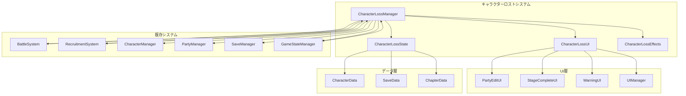

# 設計書

## 概要

キャラクターロストシステムは、「魔性の薔薇」SRPGにおける戦略性の核となるシステムです。敵の攻撃でキャラクターが撃破されると、その章内では使用不可となり、章クリア時にロスト状態がリセットされます。このシステムは戦闘システム、仲間化システム、パーティ編成システムと密接に連携し、プレイヤーに緊張感のある戦略的判断を求めます。

## アーキテクチャ

### システム構成図



### データフロー

1. **章開始フェーズ**: 全キャラクターのロスト状態を初期化
2. **戦闘フェーズ**: キャラクター撃破時にロスト処理を実行
3. **警告フェーズ**: 危険状態のキャラクターに警告表示
4. **制御フェーズ**: ロストキャラクターの使用を制限
5. **章完了フェーズ**: ロスト状態をリセットし、結果を表示

## コンポーネントと インターフェース

### CharacterLossManager（メインコントローラー）

```typescript
interface ICharacterLossManager {
  // 章管理
  initializeChapter(chapterData: ChapterData): void;
  completeChapter(): ChapterResult;

  // ロスト処理
  processCharacterLoss(unit: Unit, cause: LossCause): Promise<void>;
  isCharacterLost(characterId: string): boolean;
  getLostCharacters(): LostCharacter[];

  // 警告システム
  checkDangerState(unit: Unit): DangerLevel;
  showLossWarning(unit: Unit, action: GameAction): Promise<boolean>;

  // パーティ制御
  getAvailableCharacters(): Character[];
  validatePartyComposition(party: Character[]): ValidationResult;

  // データ管理
  saveChapterState(): void;
  loadChapterState(): void;
}

class CharacterLossManager implements ICharacterLossManager {
  private lossState: CharacterLossState;
  private lossUI: CharacterLossUI;
  private lossEffects: CharacterLossEffects;
  private battleSystem: BattleSystem;
  private recruitmentSystem: RecruitmentSystem;
  private characterManager: CharacterManager;
  private partyManager: PartyManager;
  private saveManager: SaveManager;

  constructor(dependencies: SystemDependencies) {
    this.lossState = new CharacterLossState();
    this.lossUI = new CharacterLossUI();
    this.lossEffects = new CharacterLossEffects();
    // 依存システムの注入
  }

  async processCharacterLoss(unit: Unit, cause: LossCause): Promise<void> {
    // 1. ロスト状態の記録
    this.lossState.recordLoss(unit, cause);

    // 2. 仲間化システムとの連携（NPCの場合）
    if (this.recruitmentSystem.isNPC(unit)) {
      this.recruitmentSystem.handleNPCLoss(unit);
    }

    // 3. ロスト演出の実行
    await this.lossEffects.playLossAnimation(unit, cause);

    // 4. キャラクターの除去
    this.characterManager.removeFromBattle(unit);

    // 5. UI更新
    this.lossUI.updateLossStatus();

    // 6. ゲーム状態の更新
    this.checkGameOverCondition();
  }
}
```

### CharacterLossState（状態管理）

```typescript
interface ICharacterLossState {
  // 状態管理
  initializeChapter(): void;
  recordLoss(unit: Unit, cause: LossCause): void;
  isLost(characterId: string): boolean;
  resetChapterState(): void;

  // 状態取得
  getLostCharacters(): LostCharacter[];
  getLossHistory(): LossRecord[];
  getChapterSummary(): ChapterLossSummary;

  // データ永続化
  serialize(): ChapterLossData;
  deserialize(data: ChapterLossData): void;
}

class CharacterLossState implements ICharacterLossState {
  private lostCharacters: Map<string, LostCharacter>;
  private lossHistory: LossRecord[];
  private chapterStartTime: number;

  recordLoss(unit: Unit, cause: LossCause): void {
    const lostCharacter: LostCharacter = {
      characterId: unit.id,
      name: unit.name,
      lostAt: Date.now(),
      turn: this.getCurrentTurn(),
      cause: cause,
      level: unit.level,
      wasRecruited: this.recruitmentSystem?.isRecruited(unit) || false,
    };

    this.lostCharacters.set(unit.id, lostCharacter);
    this.lossHistory.push({
      ...lostCharacter,
      timestamp: Date.now(),
    });
  }

  isLost(characterId: string): boolean {
    return this.lostCharacters.has(characterId);
  }

  resetChapterState(): void {
    this.lostCharacters.clear();
    this.lossHistory = [];
    this.chapterStartTime = Date.now();
  }
}
```

### CharacterLossUI（UI管理）

```typescript
interface ICharacterLossUI {
  // 警告UI
  showDangerWarning(unit: Unit, dangerLevel: DangerLevel): void;
  showLossConfirmation(unit: Unit, action: GameAction): Promise<boolean>;
  hideDangerWarning(unit: Unit): void;

  // 状態表示
  updateCharacterStatus(unit: Unit): void;
  showLossAnimation(unit: Unit): Promise<void>;
  updatePartyEditUI(): void;

  // 章完了UI
  showChapterResults(summary: ChapterLossSummary): Promise<void>;
  showLossHistory(history: LossRecord[]): void;
}

class CharacterLossUI implements ICharacterLossUI {
  private scene: Phaser.Scene;
  private warningIndicators: Map<string, Phaser.GameObjects.Container>;
  private lossAnimations: Map<string, Phaser.Tweens.Tween>;

  showDangerWarning(unit: Unit, dangerLevel: DangerLevel): void {
    const indicator = this.createWarningIndicator(unit, dangerLevel);
    this.warningIndicators.set(unit.id, indicator);

    // 危険度に応じた視覚効果
    switch (dangerLevel) {
      case DangerLevel.CRITICAL:
        indicator.setTint(0xff0000); // 赤色
        this.addPulseEffect(indicator);
        break;
      case DangerLevel.HIGH:
        indicator.setTint(0xff8800); // オレンジ色
        break;
      case DangerLevel.MEDIUM:
        indicator.setTint(0xffff00); // 黄色
        break;
    }
  }

  async showLossConfirmation(unit: Unit, action: GameAction): Promise<boolean> {
    return new Promise(resolve => {
      const dialog = this.createConfirmationDialog(`${unit.name}が撃破される可能性があります。\n続行しますか？`, [
        { text: '続行', callback: () => resolve(true) },
        { text: 'キャンセル', callback: () => resolve(false) },
      ]);

      this.scene.add.existing(dialog);
    });
  }

  async showChapterResults(summary: ChapterLossSummary): Promise<void> {
    const resultsPanel = this.createResultsPanel(summary);

    // ロストキャラクターの表示
    if (summary.lostCharacters.length > 0) {
      const lossSection = this.createLossSection(summary.lostCharacters);
      resultsPanel.add(lossSection);
    } else {
      const perfectSection = this.createPerfectClearSection();
      resultsPanel.add(perfectSection);
    }

    return this.showModalPanel(resultsPanel);
  }
}
```

### CharacterLossEffects（演出管理）

```typescript
interface ICharacterLossEffects {
  playLossAnimation(unit: Unit, cause: LossCause): Promise<void>;
  showDangerEffect(unit: Unit, dangerLevel: DangerLevel): void;
  hideDangerEffect(unit: Unit): void;
  playChapterResetEffect(): Promise<void>;
}

class CharacterLossEffects implements ICharacterLossEffects {
  private scene: Phaser.Scene;
  private effectPool: Map<string, Phaser.GameObjects.Particles.ParticleEmitter>;

  async playLossAnimation(unit: Unit, cause: LossCause): Promise<void> {
    // 1. キャラクターの点滅効果
    await this.playBlinkEffect(unit);

    // 2. 原因に応じた特殊効果
    switch (cause.type) {
      case LossCauseType.BATTLE_DEFEAT:
        await this.playBattleDefeatEffect(unit);
        break;
      case LossCauseType.CRITICAL_DAMAGE:
        await this.playCriticalDamageEffect(unit);
        break;
      case LossCauseType.STATUS_EFFECT:
        await this.playStatusEffectLoss(unit, cause.statusType);
        break;
    }

    // 3. フェードアウト効果
    await this.playFadeOutEffect(unit);

    // 4. ロストメッセージ表示
    await this.showLossMessage(unit, cause);
  }

  showDangerEffect(unit: Unit, dangerLevel: DangerLevel): void {
    const effect = this.createDangerParticleEffect(unit.position, dangerLevel);
    this.effectPool.set(unit.id, effect);
  }
}
```

## データモデル

### ロスト関連データ構造

```typescript
interface LostCharacter {
  characterId: string;
  name: string;
  lostAt: number;
  turn: number;
  cause: LossCause;
  level: number;
  wasRecruited: boolean;
}

interface LossCause {
  type: LossCauseType;
  sourceId?: string; // 攻撃者のID
  sourceName?: string; // 攻撃者の名前
  damageAmount?: number;
  statusType?: StatusEffectType;
  description: string;
}

enum LossCauseType {
  BATTLE_DEFEAT = 'battle_defeat',
  CRITICAL_DAMAGE = 'critical_damage',
  STATUS_EFFECT = 'status_effect',
  ENVIRONMENTAL = 'environmental',
  SACRIFICE = 'sacrifice',
}

interface LossRecord {
  characterId: string;
  name: string;
  lostAt: number;
  turn: number;
  cause: LossCause;
  level: number;
  wasRecruited: boolean;
  timestamp: number;
}

interface ChapterLossSummary {
  chapterId: string;
  totalCharacters: number;
  lostCharacters: LostCharacter[];
  survivedCharacters: Character[];
  chapterDuration: number;
  totalTurns: number;
  isPerfectClear: boolean;
}

enum DangerLevel {
  NONE = 'none',
  LOW = 'low',
  MEDIUM = 'medium',
  HIGH = 'high',
  CRITICAL = 'critical',
}

interface ChapterLossData {
  chapterId: string;
  lostCharacters: Map<string, LostCharacter>;
  lossHistory: LossRecord[];
  chapterStartTime: number;
  version: string;
}
```

### パーティ編成データ拡張

```typescript
interface PartyValidationResult {
  isValid: boolean;
  errors: PartyValidationError[];
  warnings: PartyValidationWarning[];
  availableCharacters: Character[];
  lostCharacters: LostCharacter[];
}

interface PartyValidationError {
  type: 'lost_character' | 'insufficient_members' | 'invalid_character';
  characterId?: string;
  message: string;
}

interface PartyValidationWarning {
  type: 'low_level' | 'unbalanced_party' | 'missing_role';
  message: string;
  severity: 'low' | 'medium' | 'high';
}
```

## エラーハンドリング

### エラー分類

```typescript
enum CharacterLossError {
  INVALID_CHARACTER = 'invalid_character',
  ALREADY_LOST = 'already_lost',
  CHAPTER_NOT_INITIALIZED = 'chapter_not_initialized',
  SAVE_DATA_CORRUPTED = 'save_data_corrupted',
  SYSTEM_ERROR = 'system_error',
}

class CharacterLossErrorHandler {
  handleError(error: CharacterLossError, context: LossContext): void {
    switch (error) {
      case CharacterLossError.INVALID_CHARACTER:
        this.logError('無効なキャラクターでロスト処理が実行されました', context);
        break;
      case CharacterLossError.ALREADY_LOST:
        this.logWarning('既にロスト状態のキャラクターに対してロスト処理が実行されました', context);
        break;
      case CharacterLossError.SAVE_DATA_CORRUPTED:
        this.handleSaveDataCorruption(context);
        break;
    }
  }

  private handleSaveDataCorruption(context: LossContext): void {
    // セーブデータが破損している場合の復旧処理
    this.resetToDefaultState();
    this.showRecoveryMessage();
  }
}
```

## 既存システムとの統合

### 戦闘システム統合

```typescript
// BattleSystemの拡張
class BattleSystem {
  private characterLossManager: CharacterLossManager;

  async handleUnitDefeated(unit: Unit, attacker: Unit): Promise<void> {
    // 従来の処理
    this.updateBattleState(unit);

    // ロストシステムとの連携
    const cause: LossCause = {
      type: LossCauseType.BATTLE_DEFEAT,
      sourceId: attacker.id,
      sourceName: attacker.name,
      damageAmount: this.getLastDamageAmount(),
      description: `${attacker.name}の攻撃により撃破`,
    };

    await this.characterLossManager.processCharacterLoss(unit, cause);
  }
}
```

### 仲間化システム統合

```typescript
// RecruitmentSystemの拡張
class RecruitmentSystem {
  private characterLossManager: CharacterLossManager;

  handleNPCLoss(unit: Unit): void {
    // NPC状態の解除
    this.npcStateManager.removeNPC(unit);

    // 仲間化失敗の記録
    this.recordRecruitmentFailure(unit, 'npc_defeated');

    // UI更新
    this.recruitmentUI.showRecruitmentFailure(unit, 'NPCが撃破されました');
  }
}
```

### パーティ管理システム統合

```typescript
// PartyManagerの拡張
class PartyManager {
  private characterLossManager: CharacterLossManager;

  getAvailableCharacters(): Character[] {
    const allCharacters = this.getAllCharacters();
    return allCharacters.filter(char => !this.characterLossManager.isCharacterLost(char.id));
  }

  validatePartyComposition(party: Character[]): PartyValidationResult {
    const result: PartyValidationResult = {
      isValid: true,
      errors: [],
      warnings: [],
      availableCharacters: this.getAvailableCharacters(),
      lostCharacters: this.characterLossManager.getLostCharacters(),
    };

    // ロストキャラクターのチェック
    party.forEach(char => {
      if (this.characterLossManager.isCharacterLost(char.id)) {
        result.isValid = false;
        result.errors.push({
          type: 'lost_character',
          characterId: char.id,
          message: `${char.name}は章内で使用できません`,
        });
      }
    });

    return result;
  }
}
```

## テスト戦略

### ユニットテスト対象

1. **CharacterLossManager**: ロスト処理ロジック
2. **CharacterLossState**: 状態管理の正確性
3. **CharacterLossUI**: UI表示・更新ロジック
4. **CharacterLossEffects**: 演出システム

### 統合テスト対象

1. **戦闘システム連携**: 撃破→ロスト処理の流れ
2. **仲間化システム連携**: NPC撃破→仲間化失敗の流れ
3. **パーティ管理連携**: ロスト状態→編成制限の流れ
4. **セーブ・ロード連携**: ロスト状態の永続化

### E2Eテスト対象

1. **完全なロストフロー**: 撃破→ロスト→章完了→リセット
2. **警告システム**: 危険状態→警告表示→プレイヤー判断
3. **複数ロスト管理**: 複数キャラクターの同時ロスト
4. **パーティ編成制限**: ロストキャラクターの選択不可

## パフォーマンス考慮事項

### 最適化ポイント

1. **状態チェック**: ロスト状態の高速判定
2. **UI更新**: 必要時のみUI要素を更新
3. **演出管理**: エフェクトの効率的な管理
4. **データ保存**: 軽量なシリアライゼーション

### メモリ使用量目標

- ロスト状態データ: 200B/キャラクター
- UI要素: 1KB/表示中要素
- 演出エフェクト: 500B/アクティブエフェクト
- 総使用量目標: 20KB以下（30体のキャラクター想定）

## セキュリティ考慮事項

### データ整合性

1. **状態検証**: ロスト状態の妥当性チェック
2. **重複防止**: 同一キャラクターの重複ロスト防止
3. **不正操作防止**: 不正なロスト状態変更の防止
4. **データ検証**: セーブデータの整合性確認

## 実装フェーズ

### フェーズ1: 基盤システム（1週間）

- CharacterLossManager基本クラス
- CharacterLossState実装
- 基本的なロスト処理

### フェーズ2: 戦闘システム統合（1週間）

- BattleSystemとの連携
- ロスト発生処理
- 基本的な演出

### フェーズ3: UI・警告システム（1週間）

- CharacterLossUI実装
- 警告システム実装
- パーティ編成UI統合

### フェーズ4: 章管理・データ永続化（1週間）

- 章開始・完了処理
- セーブ・ロード連携
- データ整合性確保

### フェーズ5: 最適化・テスト（1週間）

- パフォーマンス最適化
- 包括的テスト実装
- エラーハンドリング強化

この設計により、「魔性の薔薇」の世界観に適した緊張感のあるキャラクターロストシステムを実現し、プレイヤーに戦略的な判断を求める深いゲームプレイを提供します。
