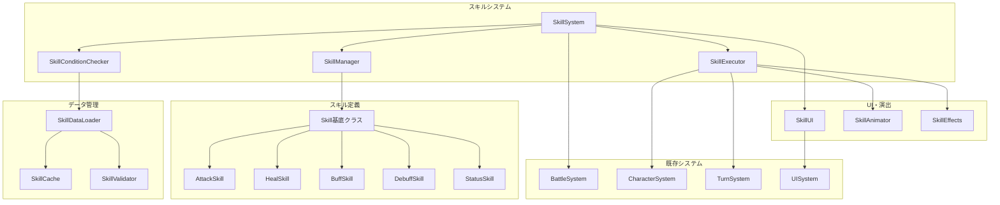

# 設計書

## 概要

スキル・アビリティシステムは、キャラクターが戦闘中に使用できる特殊能力を管理するシステムです。既存の戦闘システムと統合し、戦略性を向上させる多様な戦術的選択肢を提供します。

## アーキテクチャ

### システム構成図



## コンポーネント設計

### 1. Skill基底クラス

```typescript
abstract class Skill {
  id: string;
  name: string;
  description: string;
  skillType: SkillType;
  mpCost: number;
  targetType: TargetType;
  range: number;
  cooldown: number;
  usageLimit: number;
  
  abstract execute(caster: Unit, targets: Unit[]): SkillResult;
  abstract canUse(caster: Unit): boolean;
  abstract getValidTargets(caster: Unit, battlefield: Battlefield): Position[];
}
```

### 2. SkillSystem メインコントローラー

```typescript
class SkillSystem {
  private skillManager: SkillManager;
  private skillExecutor: SkillExecutor;
  private conditionChecker: SkillConditionChecker;
  private skillUI: SkillUI;
  
  // スキル使用の主要フロー
  async useSkill(skillId: string, caster: Unit, targetPosition: Position): Promise<SkillResult>;
  
  // スキル選択UI表示
  showSkillSelection(character: Unit): void;
  
  // 使用可能スキル取得
  getAvailableSkills(character: Unit): Skill[];
  
  // スキル効果範囲表示
  showSkillRange(skill: Skill, caster: Unit): void;
}
```

### 3. 具体的なスキルクラス

#### AttackSkill（攻撃スキル）

```typescript
class AttackSkill extends Skill {
  damageMultiplier: number;
  damageType: DamageType;
  hitCount: number;
  
  execute(caster: Unit, targets: Unit[]): SkillResult {
    // ダメージ計算と適用
    // 既存のDamageCalculatorを活用
  }
}
```

#### HealSkill（回復スキル）

```typescript
class HealSkill extends Skill {
  healAmount: number;
  healType: HealType; // 固定値 or 割合
  
  execute(caster: Unit, targets: Unit[]): SkillResult {
    // HP回復処理
  }
}
```

#### BuffSkill（バフスキル）

```typescript
class BuffSkill extends Skill {
  buffType: BuffType;
  buffValue: number;
  duration: number;
  
  execute(caster: Unit, targets: Unit[]): SkillResult {
    // バフ効果適用
  }
}
```

### 4. SkillManager（スキル管理）

```typescript
class SkillManager {
  private skills: Map<string, Skill>;
  private characterSkills: Map<string, string[]>;
  
  // スキル登録・取得
  registerSkill(skill: Skill): void;
  getSkill(skillId: string): Skill | null;
  
  // キャラクター別スキル管理
  getCharacterSkills(characterId: string): Skill[];
  addSkillToCharacter(characterId: string, skillId: string): void;
  
  // スキル習得判定
  canLearnSkill(character: Unit, skillId: string): boolean;
}
```

### 5. SkillExecutor（スキル実行）

```typescript
class SkillExecutor {
  private animator: SkillAnimator;
  private effectsManager: SkillEffects;
  
  async executeSkill(skill: Skill, caster: Unit, targets: Unit[]): Promise<SkillResult> {
    // 1. 前処理（MP消費、クールダウン設定）
    // 2. アニメーション開始
    // 3. スキル効果適用
    // 4. 結果の戦闘システムへの反映
    // 5. 後処理（状態更新、UI更新）
  }
  
  private async playSkillAnimation(skill: Skill, caster: Unit, targets: Unit[]): Promise<void>;
  private applySkillEffects(skill: Skill, caster: Unit, targets: Unit[]): SkillResult;
}
```

### 6. SkillConditionChecker（使用条件チェック）

```typescript
class SkillConditionChecker {
  canUseSkill(skill: Skill, caster: Unit): SkillUsabilityResult {
    // MP不足チェック
    // レベル制限チェック
    // 装備条件チェック
    // クールダウンチェック
    // 使用回数制限チェック
  }
  
  getValidTargets(skill: Skill, caster: Unit, battlefield: Battlefield): Position[] {
    // 射程範囲内の有効な対象位置を計算
  }
  
  isValidTarget(skill: Skill, caster: Unit, target: Unit): boolean {
    // 対象の有効性チェック（敵/味方、生存状態等）
  }
}
```

## データモデル

### スキルデータ構造

```typescript
interface SkillData {
  id: string;
  name: string;
  description: string;
  skillType: SkillType;
  targetType: TargetType;
  
  // コスト・制限
  mpCost: number;
  cooldown: number;
  usageLimit: number;
  levelRequirement: number;
  weaponRequirement?: string[];
  
  // 効果範囲
  range: number;
  areaOfEffect: {
    shape: 'single' | 'line' | 'cross' | 'square' | 'circle';
    size: number;
  };
  
  // 効果パラメータ
  effects: SkillEffect[];
  
  // アニメーション・演出
  animation: {
    castAnimation: string;
    effectAnimation: string;
    duration: number;
  };
  
  // 習得条件
  learnConditions: {
    level?: number;
    prerequisiteSkills?: string[];
    jobRequirement?: string;
  };
}

interface SkillEffect {
  type: 'damage' | 'heal' | 'buff' | 'debuff' | 'status';
  value: number;
  duration?: number;
  target: 'self' | 'ally' | 'enemy' | 'all';
}
```

### キャラクタースキル管理

```typescript
interface CharacterSkillData {
  characterId: string;
  availableSkills: string[];
  skillCooldowns: Map<string, number>;
  skillUsageCounts: Map<string, number>;
  
  // スキル習得履歴
  learnedSkills: {
    skillId: string;
    learnedAt: number; // レベル
    learnedDate: Date;
  }[];
}
```

## UI設計

### 1. スキル選択UI

```typescript
class SkillSelectionUI {
  // スキル一覧表示
  showSkillList(skills: Skill[], character: Unit): void;
  
  // スキル詳細表示
  showSkillDetails(skill: Skill): void;
  
  // 使用不可理由表示
  showUsabilityInfo(skill: Skill, reason: string): void;
  
  // キーボード操作対応
  handleKeyboardNavigation(key: string): void;
}
```

### 2. スキル効果範囲表示

```typescript
class SkillRangeDisplay {
  // 射程範囲表示
  showRange(skill: Skill, casterPosition: Position): void;
  
  // 効果範囲表示
  showAreaOfEffect(skill: Skill, targetPosition: Position): void;
  
  // 有効な対象ハイライト
  highlightValidTargets(validPositions: Position[]): void;
  
  // 範囲表示クリア
  clearRangeDisplay(): void;
}
```

### 3. スキル情報パネル

```typescript
class SkillInfoPanel {
  // スキル説明表示
  showDescription(skill: Skill): void;
  
  // コスト・制限情報表示
  showCostInfo(skill: Skill, character: Unit): void;
  
  // クールダウン表示
  showCooldownInfo(skill: Skill, character: Unit): void;
  
  // 効果予測表示
  showEffectPreview(skill: Skill, targets: Unit[]): void;
}
```

## アニメーション・エフェクト設計

### 1. SkillAnimator

```typescript
class SkillAnimator {
  // キャスト（詠唱）アニメーション
  async playCastAnimation(skill: Skill, caster: Unit): Promise<void>;
  
  // スキル発動アニメーション
  async playSkillAnimation(skill: Skill, caster: Unit, targets: Unit[]): Promise<void>;
  
  // ヒットエフェクト
  async playHitEffect(skill: Skill, target: Unit): Promise<void>;
  
  // 継続効果の視覚表現
  showContinuousEffect(effect: ContinuousEffect, target: Unit): void;
}
```

### 2. エフェクト種別

- **攻撃スキル**: 斬撃、魔法弾、爆発等のエフェクト
- **回復スキル**: 光の粒子、回復オーラ等
- **バフスキル**: キャラクター周囲の強化エフェクト
- **デバフスキル**: 暗いオーラ、弱体化エフェクト
- **状態異常**: 毒、麻痺等の継続エフェクト

## 戦闘システム統合

### 1. BattleSystemとの連携

```typescript
// BattleSystemに追加するメソッド
class BattleSystem {
  private skillSystem: SkillSystem;
  
  // スキル使用アクション
  async executeSkillAction(action: SkillAction): Promise<ActionResult> {
    const result = await this.skillSystem.useSkill(
      action.skillId,
      action.caster,
      action.targetPosition
    );
    
    // 戦闘結果に反映
    this.updateBattleState(result);
    return this.createActionResult(result);
  }
  
  // スキル選択フェーズ
  enterSkillSelectionPhase(character: Unit): void {
    this.skillSystem.showSkillSelection(character);
  }
}
```

### 2. ターン制システムとの統合

```typescript
// TurnManagerに追加
class TurnManager {
  // スキル使用後のターン処理
  handleSkillUsage(character: Unit, skill: Skill): void {
    // クールダウン管理
    this.setSkillCooldown(character, skill);
    
    // ターン終了判定
    if (this.shouldEndTurn(character)) {
      this.nextTurn();
    }
  }
  
  // ターン開始時のスキル状態更新
  updateSkillStates(character: Unit): void {
    // クールダウン減少
    this.decreaseSkillCooldowns(character);
    
    // 継続効果の処理
    this.processContinuousEffects(character);
  }
}
```

## エラーハンドリング

### 1. エラー種別

```typescript
enum SkillError {
  INSUFFICIENT_MP = 'insufficient_mp',
  SKILL_ON_COOLDOWN = 'skill_on_cooldown',
  INVALID_TARGET = 'invalid_target',
  OUT_OF_RANGE = 'out_of_range',
  USAGE_LIMIT_EXCEEDED = 'usage_limit_exceeded',
  LEVEL_REQUIREMENT_NOT_MET = 'level_requirement_not_met',
  WEAPON_REQUIREMENT_NOT_MET = 'weapon_requirement_not_met',
  SKILL_NOT_FOUND = 'skill_not_found',
  ANIMATION_ERROR = 'animation_error',
  DATA_CORRUPTION = 'data_corruption'
}
```

### 2. エラーハンドリング戦略

```typescript
class SkillErrorHandler {
  handleSkillError(error: SkillError, context: SkillContext): void {
    switch (error) {
      case SkillError.INSUFFICIENT_MP:
        this.showMPWarning(context.caster);
        break;
      case SkillError.SKILL_ON_COOLDOWN:
        this.showCooldownInfo(context.skill, context.caster);
        break;
      case SkillError.INVALID_TARGET:
        this.showTargetingHelp(context.skill);
        break;
      // その他のエラー処理...
    }
  }
  
  // 回復可能なエラーの自動修復
  attemptErrorRecovery(error: SkillError, context: SkillContext): boolean;
}
```

## テスト戦略

### 1. 単体テスト

- 各スキルクラスの効果計算
- 使用条件チェックロジック
- データ読み込み・検証
- エラーハンドリング

### 2. 統合テスト

- 戦闘システムとの連携
- UI表示・操作
- アニメーション・エフェクト
- データ永続化

### 3. E2Eテスト

- 完全なスキル使用フロー
- 複数スキルの組み合わせ
- エラーシナリオ
- パフォーマンステスト

## パフォーマンス考慮事項

### 1. 最適化ポイント

- **スキルデータキャッシュ**: 頻繁にアクセスされるデータのメモリキャッシュ
- **条件チェック最適化**: 早期リターンによる不要な計算の回避
- **アニメーション最適化**: オブジェクトプールによるメモリ管理
- **エフェクト管理**: 同時表示エフェクト数の制限

### 2. メモリ管理

```typescript
class SkillMemoryManager {
  // スキルオブジェクトプール
  private skillPool: Map<string, Skill[]>;
  
  // エフェクトオブジェクトプール
  private effectPool: SkillEffect[];
  
  // 未使用オブジェクトの回収
  cleanup(): void;
  
  // メモリ使用量監視
  getMemoryUsage(): MemoryUsageInfo;
}
```

## 拡張性設計

### 1. 新スキル追加の容易性

- JSONデータのみでの新スキル定義
- プラグイン形式でのカスタムスキル追加
- スキル効果の組み合わせによる複合スキル

### 2. バランス調整の柔軟性

- 設定ファイルによるパラメータ調整
- A/Bテスト対応
- リアルタイムバランス調整（開発時）

この設計に基づいて、段階的にスキル・アビリティシステムを実装していきます。
