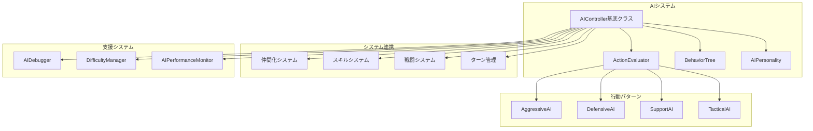

# 設計文書

## 概要

AIシステムは、敵キャラクターの自動行動を制御する包括的なシステムです。戦略的思考、多様な行動パターン、ゲーム固有システムとの連携を提供し、プレイヤーに適切な挑戦と戦術的深度を与えます。

## アーキテクチャ

### システム構成図



## コンポーネントと インターフェース

### 1. AIController基底クラス

```typescript
abstract class AIController {
  protected character: Unit;
  protected gameState: GameState;
  protected personality: AIPersonality;
  protected difficultyLevel: number;
  
  abstract decideAction(): Promise<AIAction>;
  abstract evaluatePosition(): number;
  abstract getPriority(): number;
  
  // 共通メソッド
  protected getValidActions(): AIAction[];
  protected evaluateAction(action: AIAction): number;
  protected executeAction(action: AIAction): Promise<void>;
}
```

### 2. ActionEvaluator（行動評価システム）

```typescript
interface ActionEvaluator {
  evaluateMove(from: Position, to: Position): number;
  evaluateAttack(attacker: Unit, target: Unit): number;
  evaluateSkillUse(skill: Skill, target: Unit[]): number;
  evaluateWait(): number;
  
  // 戦術的評価
  evaluatePositionalAdvantage(position: Position): number;
  evaluateTerrainBonus(position: Position): number;
  evaluateThreatLevel(position: Position): number;
}
```

### 3. BehaviorTree（行動決定木）

```typescript
interface BehaviorNode {
  execute(context: AIContext): BehaviorResult;
}

class BehaviorTree {
  private rootNode: BehaviorNode;
  
  execute(context: AIContext): AIAction;
  addNode(node: BehaviorNode): void;
  removeNode(nodeId: string): void;
}

// 行動ノードの例
class AttackNearestEnemyNode implements BehaviorNode {
  execute(context: AIContext): BehaviorResult;
}

class ProtectNPCNode implements BehaviorNode {
  execute(context: AIContext): BehaviorResult;
}
```

### 4. AIPersonality（AI性格システム）

```typescript
interface AIPersonality {
  aggressiveness: number;    // 0-1: 攻撃性
  defensiveness: number;     // 0-1: 防御性
  supportiveness: number;    // 0-1: 支援性
  tacticalness: number;      // 0-1: 戦術性
  riskTolerance: number;     // 0-1: リスク許容度
  
  // 行動修正値
  getActionModifier(actionType: ActionType): number;
  shouldTakeRisk(riskLevel: number): boolean;
  getPriorityModifier(target: Unit): number;
}
```

## データモデル

### AIAction（AI行動データ）

```typescript
interface AIAction {
  type: ActionType;
  character: Unit;
  target?: Unit;
  targetPosition?: Position;
  skill?: Skill;
  priority: number;
  evaluationScore: number;
  reasoning?: string; // デバッグ用
}

enum ActionType {
  MOVE = 'move',
  ATTACK = 'attack',
  SKILL = 'skill',
  WAIT = 'wait',
  DEFEND = 'defend'
}
```

### AIContext（AI思考コンテキスト）

```typescript
interface AIContext {
  currentCharacter: Unit;
  gameState: GameState;
  visibleEnemies: Unit[];
  visibleAllies: Unit[];
  npcs: Unit[];
  availableSkills: Skill[];
  terrainData: TerrainData;
  turnNumber: number;
  difficultySettings: DifficultySettings;
}
```

### DifficultySettings（難易度設定）

```typescript
interface DifficultySettings {
  thinkingDepth: number;        // 1-5: 思考深度
  randomnessFactor: number;     // 0-1: ランダム要素
  mistakeProbability: number;   // 0-1: ミス確率
  reactionTime: number;         // ms: 反応時間
  skillUsageFrequency: number;  // 0-1: スキル使用頻度
}
```

## エラーハンドリング

### AIError階層

```typescript
abstract class AIError extends Error {
  abstract getRecoveryAction(): AIAction;
}

class AIThinkingTimeoutError extends AIError {
  getRecoveryAction(): AIAction {
    return { type: ActionType.WAIT, priority: 0 };
  }
}

class InvalidActionError extends AIError {
  getRecoveryAction(): AIAction {
    // 有効な代替行動を返す
  }
}

class AIDataCorruptionError extends AIError {
  getRecoveryAction(): AIAction {
    // 基本AIパターンにフォールバック
  }
}
```

### エラー回復戦略

1. **タイムアウト処理**: 2秒以内に行動決定できない場合は待機
2. **無効行動処理**: 無効な行動が選択された場合は代替行動を自動選択
3. **データ破損処理**: AIデータが破損した場合は基本パターンで継続
4. **メモリ不足処理**: リソース不足時は適切にクリーンアップ

## テスト戦略

### 1. ユニットテスト

- 各AIコントローラーの行動決定ロジック
- ActionEvaluatorの評価計算
- BehaviorTreeの実行フロー
- AIPersonalityの修正値計算

### 2. 統合テスト

- AI行動とゲームシステムの連携
- 複数AIの同時実行
- 難易度調整の効果検証
- パフォーマンス要件の確認

### 3. E2Eテスト

- 完全な戦闘フローでのAI行動
- NPC保護シナリオの検証
- スキル使用パターンの確認
- エラー回復シナリオのテスト

## パフォーマンス設計

### 最適化戦略

1. **思考時間制限**: 2秒のハードリミット設定
2. **行動キャッシュ**: 類似状況での行動結果をキャッシュ
3. **段階的評価**: 明らかに劣る選択肢の早期除外
4. **並列処理**: 複数AIの思考を並列実行
5. **メモリプール**: AIオブジェクトの再利用

### パフォーマンス監視

```typescript
class AIPerformanceMonitor {
  private thinkingTimes: number[] = [];
  private memoryUsage: number[] = [];
  
  recordThinkingTime(time: number): void;
  recordMemoryUsage(usage: number): void;
  getAverageThinkingTime(): number;
  getMemoryTrend(): number[];
  
  // アラート機能
  checkPerformanceThresholds(): PerformanceAlert[];
}
```

## デバッグ・開発支援

### AIDebugger

```typescript
class AIDebugger {
  private isEnabled: boolean = false;
  private logLevel: LogLevel = LogLevel.INFO;
  
  logThinkingProcess(character: Unit, actions: AIAction[]): void;
  logActionSelection(selectedAction: AIAction, reasoning: string): void;
  logPerformanceMetrics(metrics: PerformanceMetrics): void;
  
  // ビジュアルデバッグ
  showThinkingVisualization(character: Unit): void;
  showActionEvaluation(actions: AIAction[]): void;
  showBehaviorTree(tree: BehaviorTree): void;
}
```

### コンソールコマンド

```typescript
// 開発用コンソールコマンド
window.aiDebug = {
  setDifficulty: (level: number) => void,
  forceAction: (characterId: string, action: AIAction) => void,
  showThinking: (characterId: string) => void,
  getStats: () => AIStatistics,
  resetAI: (characterId: string) => void
};
```

## セキュリティ考慮事項

### チート対策

1. **行動検証**: AI行動の妥当性をサーバーサイドで検証
2. **ランダム性**: 予測可能なパターンの回避
3. **データ暗号化**: AI設定データの暗号化
4. **ログ監視**: 異常な行動パターンの検出

## 拡張性設計

### プラグインアーキテクチャ

```typescript
interface AIPlugin {
  name: string;
  version: string;
  initialize(aiSystem: AISystem): void;
  getCustomBehaviors(): BehaviorNode[];
  getCustomEvaluators(): ActionEvaluator[];
}

class AIPluginManager {
  private plugins: Map<string, AIPlugin> = new Map();
  
  registerPlugin(plugin: AIPlugin): void;
  unregisterPlugin(pluginName: string): void;
  getPlugin(pluginName: string): AIPlugin | null;
}
```

### 設定可能性

- JSON設定ファイルによるAI行動パラメータの調整
- ランタイムでの難易度変更
- カスタムAI性格の定義
- 行動パターンの動的追加・削除

## 実装優先順位

### フェーズ1: 基盤システム（2週間）

1. AIController基底クラス
2. ActionEvaluator基本機能
3. 基本的な行動パターン（攻撃、移動、待機）

### フェーズ2: 高度な行動パターン（2週間）

1. 各種AI性格の実装
2. BehaviorTreeシステム
3. NPC保護ロジック

### フェーズ3: システム統合（1週間）

1. 既存システムとの連携
2. スキルシステム統合
3. パフォーマンス最適化

### フェーズ4: 品質向上（1週間）

1. デバッグツール実装
2. エラーハンドリング強化
3. 包括的テスト実装

この設計により、戦略的で多様なAI行動を提供し、ゲーム固有システムとの密接な連携を実現します。
