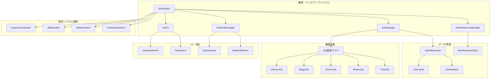

# 設計文書

## 概要

職業・ランクアップシステムは、キャラクターの職業管理と薔薇の力を使用した職業ランクアップを提供するシステムです。既存の経験値システム、スキルシステム、戦闘システムと密接に連携し、「魔性の薔薇」の世界観に基づいた独特な成長システムを実現します。

## アーキテクチャ

### システム構成図



### データフロー

1. **職業初期化**: キャラクター作成時に初期職業を設定
2. **能力値適用**: 職業に応じた基本能力値修正を適用
3. **スキル管理**: 職業別使用可能スキルの設定・更新
4. **薔薇の力獲得**: ボス撃破時に薔薇の力を獲得・蓄積
5. **ランクアップ判定**: 薔薇の力とキャラクター条件でランクアップ可能性を判定
6. **ランクアップ実行**: 薔薇の力を消費して職業をランクアップ
7. **能力値・スキル更新**: ランクアップ後の新しい能力値とスキルを適用

## コンポーネント設計

### 1. JobSystem（メインコントローラー）

```typescript
class JobSystem {
  private jobManager: JobManager;
  private roseEssenceManager: RoseEssenceManager;
  private rankUpManager: RankUpManager;
  private jobUI: JobUI;
  
  // 職業システム初期化
  initialize(jobData: JobTableData, roseEssenceData: RoseEssenceData): void;
  
  // キャラクターの職業設定
  setCharacterJob(characterId: string, jobId: string): void;
  
  // 職業変更
  changeJob(characterId: string, newJobId: string): JobChangeResult;
  
  // ランクアップ実行
  rankUpJob(characterId: string, targetRank: number): RankUpResult;
  
  // 薔薇の力獲得処理
  awardRoseEssence(amount: number, source: RoseEssenceSource): void;
  
  // ランクアップ可能判定
  canRankUp(characterId: string): RankUpAvailability;
}
```

### 2. Job基底クラス

```typescript
abstract class Job {
  id: string;
  name: string;
  description: string;
  rank: number;
  maxRank: number;
  
  // 基本能力値修正
  abstract getStatModifiers(): StatModifiers;
  
  // 使用可能スキル
  abstract getAvailableSkills(): string[];
  
  // ランクアップ条件
  abstract getRankUpRequirements(targetRank: number): RankUpRequirements;
  
  // 職業特性
  abstract getJobTraits(): JobTrait[];
  
  // 成長率修正
  abstract getGrowthRateModifiers(): GrowthRateModifiers;
}
```

### 3. 具体的な職業クラス

#### WarriorJob（戦士）

```typescript
class WarriorJob extends Job {
  getStatModifiers(): StatModifiers {
    return {
      hp: this.rank * 5,
      attack: this.rank * 3,
      defense: this.rank * 2,
      speed: -this.rank * 1,
      // その他の能力値修正
    };
  }
  
  getAvailableSkills(): string[] {
    const baseSkills = ['sword_slash', 'guard'];
    if (this.rank >= 2) baseSkills.push('power_strike');
    if (this.rank >= 3) baseSkills.push('berserker_rage');
    return baseSkills;
  }
  
  getRankUpRequirements(targetRank: number): RankUpRequirements {
    return {
      roseEssenceCost: targetRank * 10,
      levelRequirement: targetRank * 5,
      prerequisiteSkills: this.getPrerequisiteSkills(targetRank),
    };
  }
}
```

#### MageJob（魔法使い）

```typescript
class MageJob extends Job {
  getStatModifiers(): StatModifiers {
    return {
      mp: this.rank * 8,
      attack: this.rank * 4, // 魔法攻撃力
      defense: -this.rank * 1,
      speed: this.rank * 1,
      // その他の能力値修正
    };
  }
  
  getAvailableSkills(): string[] {
    const baseSkills = ['fire_bolt', 'heal'];
    if (this.rank >= 2) baseSkills.push('ice_shard', 'group_heal');
    if (this.rank >= 3) baseSkills.push('meteor', 'resurrection');
    return baseSkills;
  }
}
```

### 4. JobManager（職業管理）

```typescript
class JobManager {
  private jobs: Map<string, Job>;
  private characterJobs: Map<string, CharacterJobData>;
  
  // 職業登録・取得
  registerJob(job: Job): void;
  getJob(jobId: string): Job | null;
  
  // キャラクター職業管理
  getCharacterJob(characterId: string): Job | null;
  setCharacterJob(characterId: string, jobId: string, rank: number): void;
  
  // 職業変更処理
  changeCharacterJob(characterId: string, newJobId: string): JobChangeResult;
  
  // 職業能力値計算
  calculateJobStats(characterId: string): StatModifiers;
  
  // 職業スキル取得
  getJobSkills(characterId: string): string[];
}
```

### 5. RoseEssenceManager（薔薇の力管理）

```typescript
class RoseEssenceManager {
  private roseEssenceAmount: number = 0;
  private essenceHistory: RoseEssenceTransaction[] = [];
  
  // 薔薇の力獲得
  addRoseEssence(amount: number, source: RoseEssenceSource): void;
  
  // 薔薇の力消費
  consumeRoseEssence(amount: number, purpose: string): boolean;
  
  // 現在の薔薇の力取得
  getCurrentRoseEssence(): number;
  
  // 薔薇の力履歴取得
  getEssenceHistory(): RoseEssenceTransaction[];
  
  // 薔薇の力不足チェック
  hasEnoughEssence(requiredAmount: number): boolean;
  
  // 薔薇の力獲得予測
  predictEssenceGain(bossType: BossType): number;
}
```

### 6. RankUpManager（ランクアップ管理）

```typescript
class RankUpManager {
  private jobManager: JobManager;
  private roseEssenceManager: RoseEssenceManager;
  private rankUpAnimator: JobAnimator;
  
  // ランクアップ可能性判定
  canRankUp(characterId: string, targetRank: number): RankUpAvailability;
  
  // ランクアップ実行
  executeRankUp(characterId: string, targetRank: number): Promise<RankUpResult>;
  
  // ランクアップ効果適用
  applyRankUpEffects(characterId: string, oldRank: number, newRank: number): void;
  
  // ランクアップ演出
  playRankUpAnimation(characterId: string, job: Job): Promise<void>;
  
  // ランクアップ可能キャラクター取得
  getRankUpCandidates(): CharacterRankUpInfo[];
}
```

## データモデル

### 職業データ構造

```typescript
interface JobData {
  id: string;
  name: string;
  description: string;
  category: JobCategory;
  maxRank: number;
  
  // 各ランクでの能力値修正
  statModifiers: {
    [rank: number]: StatModifiers;
  };
  
  // 各ランクでの使用可能スキル
  availableSkills: {
    [rank: number]: string[];
  };
  
  // ランクアップ要件
  rankUpRequirements: {
    [rank: number]: RankUpRequirements;
  };
  
  // 成長率修正
  growthRateModifiers: {
    [rank: number]: GrowthRateModifiers;
  };
  
  // 職業特性
  jobTraits: JobTrait[];
  
  // 視覚的表現
  visual: {
    iconPath: string;
    spriteModifications: SpriteModification[];
    colorScheme: ColorScheme;
  };
}

interface StatModifiers {
  hp: number;
  mp: number;
  attack: number;
  defense: number;
  speed: number;
  skill: number;
  luck: number;
}

interface RankUpRequirements {
  roseEssenceCost: number;
  levelRequirement: number;
  prerequisiteSkills: string[];
  completedStages?: string[];
  defeatedBosses?: string[];
}

interface JobTrait {
  id: string;
  name: string;
  description: string;
  effect: TraitEffect;
}

enum JobCategory {
  WARRIOR = 'warrior',
  MAGE = 'mage',
  ARCHER = 'archer',
  HEALER = 'healer',
  THIEF = 'thief',
  SPECIAL = 'special',
}
```

### キャラクター職業データ

```typescript
interface CharacterJobData {
  characterId: string;
  currentJobId: string;
  currentRank: number;
  jobHistory: JobHistoryEntry[];
  
  // 職業経験値（将来的な拡張用）
  jobExperience: Map<string, number>;
  
  // 習得済み職業スキル
  learnedJobSkills: Map<string, string[]>;
}

interface JobHistoryEntry {
  jobId: string;
  rank: number;
  changedAt: Date;
  roseEssenceUsed: number;
}
```

### 薔薇の力データ

```typescript
interface RoseEssenceData {
  currentAmount: number;
  totalEarned: number;
  totalSpent: number;
  
  // 獲得源別の設定
  sources: {
    [bossType: string]: {
      baseAmount: number;
      difficultyMultiplier: number;
      firstTimeBonus: number;
    };
  };
  
  // 消費用途別の設定
  costs: {
    rankUp: {
      [jobCategory: string]: {
        [rank: number]: number;
      };
    };
    jobChange: number;
    skillUnlock: number;
  };
}

interface RoseEssenceTransaction {
  id: string;
  type: 'gain' | 'spend';
  amount: number;
  source: string;
  timestamp: Date;
  characterId?: string;
  description: string;
}
```

## UI設計

### 1. 職業選択・変更UI

```typescript
class JobSelectionUI {
  // 利用可能職業一覧表示
  showAvailableJobs(characterId: string): void;
  
  // 職業詳細情報表示
  showJobDetails(job: Job): void;
  
  // 職業変更確認ダイアログ
  showJobChangeConfirmation(character: Unit, newJob: Job): Promise<boolean>;
  
  // 職業比較表示
  showJobComparison(currentJob: Job, targetJob: Job): void;
}
```

### 2. ランクアップUI

```typescript
class RankUpUI {
  // ランクアップ可能キャラクター一覧
  showRankUpCandidates(): void;
  
  // ランクアップ詳細画面
  showRankUpDetails(characterId: string, targetRank: number): void;
  
  // 薔薇の力残量表示
  showRoseEssenceStatus(): void;
  
  // ランクアップ効果プレビュー
  showRankUpPreview(character: Unit, targetRank: number): void;
  
  // ランクアップ実行確認
  showRankUpConfirmation(character: Unit, cost: number): Promise<boolean>;
}
```

### 3. 職業情報パネル

```typescript
class JobInfoPanel {
  // 現在の職業情報表示
  showCurrentJobInfo(characterId: string): void;
  
  // 職業能力値修正表示
  showStatModifiers(job: Job): void;
  
  // 職業スキル一覧表示
  showJobSkills(job: Job): void;
  
  // 職業特性表示
  showJobTraits(job: Job): void;
  
  // ランクアップ進捗表示
  showRankUpProgress(characterId: string): void;
}
```

## アニメーション・エフェクト設計

### 1. JobAnimator

```typescript
class JobAnimator {
  // 職業変更アニメーション
  async playJobChangeAnimation(character: Unit, oldJob: Job, newJob: Job): Promise<void>;
  
  // ランクアップアニメーション
  async playRankUpAnimation(character: Unit, newRank: number): Promise<void>;
  
  // 薔薇の力獲得エフェクト
  async playRoseEssenceGainEffect(amount: number): Promise<void>;
  
  // 職業オーラエフェクト
  showJobAura(character: Unit, job: Job): void;
  
  // スキル習得エフェクト
  async playSkillUnlockEffect(skill: string): Promise<void>;
}
```

### 2. エフェクト種別

- **職業変更**: キャラクター周囲の光の変化、装備・外見の変更
- **ランクアップ**: 上昇する光の柱、薔薇の花びらエフェクト
- **薔薇の力獲得**: 薔薇の花びらが舞い散るエフェクト
- **職業オーラ**: 職業に応じた色のオーラ表示
- **スキル習得**: 新スキルアイコンの光る演出

## 既存システムとの統合

### 1. ExperienceSystemとの連携

```typescript
// ExperienceSystemに追加するメソッド
class ExperienceSystem {
  private jobSystem: JobSystem;
  
  // レベルアップ時の職業効果適用
  processLevelUp(character: Unit): LevelUpResult {
    const baseResult = this.baseLevelUpProcess(character);
    
    // 職業による成長率修正を適用
    const jobModifiers = this.jobSystem.getGrowthRateModifiers(character.id);
    const modifiedResult = this.applyJobGrowthModifiers(baseResult, jobModifiers);
    
    return modifiedResult;
  }
}
```

### 2. SkillSystemとの連携

```typescript
// SkillSystemに追加するメソッド
class SkillSystem {
  private jobSystem: JobSystem;
  
  // キャラクターの使用可能スキル取得
  getAvailableSkills(characterId: string): Skill[] {
    const baseSkills = this.getBaseSkills(characterId);
    const jobSkills = this.jobSystem.getJobSkills(characterId);
    
    return [...baseSkills, ...jobSkills];
  }
  
  // 職業変更時のスキル更新
  updateSkillsOnJobChange(characterId: string): void {
    const newJobSkills = this.jobSystem.getJobSkills(characterId);
    this.updateCharacterSkills(characterId, newJobSkills);
  }
}
```

### 3. BattleSystemとの連携

```typescript
// BattleSystemに追加するメソッド
class BattleSystem {
  private jobSystem: JobSystem;
  
  // ボス撃破時の薔薇の力獲得
  handleBossDefeat(boss: Unit): void {
    const roseEssenceAmount = this.calculateRoseEssenceReward(boss);
    this.jobSystem.awardRoseEssence(roseEssenceAmount, {
      type: 'boss_defeat',
      bossId: boss.id,
    });
    
    // 薔薇の力獲得演出
    this.showRoseEssenceGainEffect(roseEssenceAmount);
  }
}
```

## エラーハンドリング

### 1. エラー種別

```typescript
enum JobSystemError {
  JOB_NOT_FOUND = 'job_not_found',
  INVALID_RANK = 'invalid_rank',
  INSUFFICIENT_ROSE_ESSENCE = 'insufficient_rose_essence',
  LEVEL_REQUIREMENT_NOT_MET = 'level_requirement_not_met',
  PREREQUISITE_SKILLS_MISSING = 'prerequisite_skills_missing',
  JOB_CHANGE_NOT_ALLOWED = 'job_change_not_allowed',
  RANK_UP_NOT_AVAILABLE = 'rank_up_not_available',
  DATA_CORRUPTION = 'data_corruption',
}
```

### 2. エラーハンドリング戦略

```typescript
class JobSystemErrorHandler {
  handleError(error: JobSystemError, context: JobSystemContext): void {
    switch (error) {
      case JobSystemError.INSUFFICIENT_ROSE_ESSENCE:
        this.showRoseEssenceShortageDialog(context);
        break;
      case JobSystemError.LEVEL_REQUIREMENT_NOT_MET:
        this.showLevelRequirementDialog(context);
        break;
      case JobSystemError.PREREQUISITE_SKILLS_MISSING:
        this.showSkillRequirementDialog(context);
        break;
      // その他のエラー処理...
    }
  }
  
  // 回復可能なエラーの自動修復
  attemptErrorRecovery(error: JobSystemError, context: JobSystemContext): boolean;
}
```

## テスト戦略

### 1. 単体テスト

- 各職業クラスの能力値計算
- ランクアップ要件チェック
- 薔薇の力の獲得・消費処理
- データ読み込み・検証

### 2. 統合テスト

- 経験値システムとの連携
- スキルシステムとの連携
- 戦闘システムとの連携
- UI表示・操作

### 3. E2Eテスト

- 完全な職業変更フロー
- ランクアップの一連の流れ
- 薔薇の力獲得から使用まで
- エラーシナリオ

## パフォーマンス考慮事項

### 1. 最適化ポイント

- **職業データキャッシュ**: 頻繁にアクセスされるデータのメモリキャッシュ
- **能力値計算最適化**: 職業修正値の事前計算とキャッシュ
- **UI更新最適化**: 不要なUI更新の抑制
- **アニメーション最適化**: エフェクトオブジェクトプールの活用

### 2. メモリ管理

```typescript
class JobSystemMemoryManager {
  // 職業オブジェクトプール
  private jobPool: Map<string, Job[]>;
  
  // エフェクトオブジェクトプール
  private effectPool: JobEffect[];
  
  // 未使用オブジェクトの回収
  cleanup(): void;
  
  // メモリ使用量監視
  getMemoryUsage(): MemoryUsageInfo;
}
```

## 拡張性設計

### 1. 新職業追加の容易性

- JSONデータのみでの新職業定義
- プラグイン形式でのカスタム職業追加
- 職業特性の組み合わせによる複合効果

### 2. バランス調整の柔軟性

- 設定ファイルによるパラメータ調整
- ランクアップコストの動的調整
- 職業能力値の段階的バランス調整

この設計に基づいて、段階的に職業・ランクアップシステムを実装していきます。

</content>
