# 設計文書

## 概要

ボス戦・勝利条件システムは、ステージの目標管理、ボス戦の特殊処理、勝利・敗北判定、そしてステージクリア報酬を統合的に管理するシステムです。「魔性の薔薇」の世界観において、ボス撃破による薔薇の力の獲得と、それを使用した職業ランクアップという独自の成長システムを実現します。

## アーキテクチャ

### システム構成図

```mermaid
graph TB
    subgraph "ボス戦・勝利条件システム"
        VCS[VictoryConditionSystem]
        OM[ObjectiveManager]
        BS[BossSystem]
        VCM[VictoryConditionManager]
        RSM[RewardSystemManager]
    end
    
    subgraph "目標管理"
        OT[ObjectiveTracker]
        OV[ObjectiveValidator]
        OUI[ObjectiveUI]
    end
    
    subgraph "ボス戦管理"
        BD[BossData]
        BAI[BossAI]
        BEff[BossEffects]
        BUI[BossUI]
    end
    
    subgraph "勝利・敗北判定"
        VCJ[VictoryConditionJudge]
        DCJ[DefeatConditionJudge]
        GRH[GameResultHandler]
    end
    
    subgraph "報酬管理"
        RC[RewardCalculator]
        REG[RoseEssenceGrant]
        RUI[RewardUI]
        RDist[RewardDistributor]
    end
    
    subgraph "既存システム連携"
        BattleSys[BattleSystem]
        ExpSys[ExperienceSystem]
        JobSys[JobSystem]
        RecSys[RecruitmentSystem]
        LossSys[CharacterLossManager]
        TurnSys[TurnManager]
    end
    
    VCS --> OM
    VCS --> BS
    VCS --> VCM
    VCS --> RSM
    
    OM --> OT
    OM --> OV
    OM --> OUI
    
    BS --> BD
    BS --> BAI
    BS --> BEff
    BS --> BUI
    
    VCM --> VCJ
    VCM --> DCJ
    VCM --> GRH
    
    RSM --> RC
    RSM --> REG
    RSM --> RUI
    RSM --> RDist
    
    VCS --> BattleSys
    VCS --> ExpSys
    VCS --> JobSys
    VCS --> RecSys
    VCS --> LossSys
    VCS --> TurnSys
```



### データフロー

1. **ステージ開始**: 勝利条件・敗北条件の読み込みと初期化
2. **目標追跡**: ターン終了時に目標達成状況を更新
3. **ボス戦処理**: ボス撃破時の特殊処理と薔薇の力獲得
4. **勝利判定**: すべての勝利条件が満たされたかチェック
5. **敗北判定**: いずれかの敗北条件が満たされたかチェック
6. **報酬計算**: ステージクリア時の報酬を計算
7. **報酬付与**: 経験値、薔薇の力、仲間化情報を各システムに反映

## コンポーネント設計

### 1. VictoryConditionSystem（メインコントローラー）

```typescript
class VictoryConditionSystem extends Phaser.Events.EventEmitter {
  private objectiveManager: ObjectiveManager;
  private bossSystem: BossSystem;
  private victoryConditionManager: VictoryConditionManager;
  private rewardSystemManager: RewardSystemManager;
  
  // システム初期化
  initialize(stageData: StageData): void;
  
  // 目標進捗更新
  updateObjectiveProgress(): void;
  
  // 勝利・敗北判定
  checkVictoryConditions(): VictoryCheckResult;
  checkDefeatConditions(): DefeatCheckResult;
  
  // ボス撃破処理
  handleBossDefeat(boss: Unit): Promise<BossDefeatResult>;
  
  // ステージクリア処理
  handleStageComplete(): Promise<StageCompleteResult>;
  
  // ステージ失敗処理
  handleStageFailure(): Promise<StageFailureResult>;
  
  // 報酬付与
  distributeRewards(rewards: StageRewards): Promise<void>;
}
```

### 2. ObjectiveManager（目標管理）

```typescript
class ObjectiveManager {
  private objectives: Map<string, Objective>;
  private objectiveTracker: ObjectiveTracker;
  private objectiveValidator: ObjectiveValidator;
  private objectiveUI: ObjectiveUI;
  
  // 目標登録
  registerObjective(objective: Objective): void;
  
  // 目標進捗更新
  updateProgress(objectiveId: string, progress: ObjectiveProgress): void;
  
  // 目標達成判定
  isObjectiveComplete(objectiveId: string): boolean;
  
  // すべての目標達成判定
  areAllObjectivesComplete(): boolean;
  
  // 目標情報取得
  getObjective(objectiveId: string): Objective | null;
  getAllObjectives(): Objective[];
  
  // 目標UI更新
  updateObjectiveUI(): void;
}
```

### 3. Objective（目標定義）

```typescript
interface Objective {
  id: string;
  type: ObjectiveType;
  description: string;
  isRequired: boolean;
  isComplete: boolean;
  progress: ObjectiveProgress;
  
  // 目標種別固有のデータ
  targetData?: ObjectiveTargetData;
}

enum ObjectiveType {
  DEFEAT_BOSS = 'defeat_boss',
  DEFEAT_ALL_ENEMIES = 'defeat_all_enemies',
  REACH_POSITION = 'reach_position',
  SURVIVE_TURNS = 'survive_turns',
  PROTECT_UNIT = 'protect_unit',
  COLLECT_ITEMS = 'collect_items',
  CUSTOM = 'custom',
}

interface ObjectiveProgress {
  current: number;
  target: number;
  percentage: number;
}

interface ObjectiveTargetData {
  // ボス撃破目標
  bossId?: string;
  
  // 到達目標
  targetPosition?: Position;
  targetArea?: Position[];
  
  // 生存目標
  surviveTurns?: number;
  
  // 保護目標
  protectUnitId?: string;
  
  // アイテム収集目標
  itemIds?: string[];
  itemCount?: number;
  
  // カスタム目標
  customCondition?: (gameState: GameState) => boolean;
}
```

### 4. BossSystem（ボス戦管理）

```typescript
class BossSystem {
  private bossData: Map<string, BossData>;
  private bossAI: BossAI;
  private bossEffects: BossEffects;
  private bossUI: BossUI;
  
  // ボス登録
  registerBoss(boss: Unit, bossData: BossData): void;
  
  // ボス判定
  isBoss(unitId: string): boolean;
  
  // ボスデータ取得
  getBossData(unitId: string): BossData | null;
  
  // ボス撃破処理
  handleBossDefeat(boss: Unit): Promise<BossDefeatResult>;
  
  // 薔薇の力計算
  calculateRoseEssenceReward(boss: Unit): number;
  
  // ボスフェーズ変化
  handleBossPhaseChange(boss: Unit, newPhase: number): void;
  
  // ボス専用AI取得
  getBossAI(bossId: string): BossAI;
  
  // ボス演出表示
  showBossIntroduction(boss: Unit): Promise<void>;
  showBossDefeatCutscene(boss: Unit): Promise<void>;
}
```

### 5. BossData（ボスデータ）

```typescript
interface BossData {
  id: string;
  name: string;
  title: string;
  description: string;
  
  // 薔薇の力
  roseEssenceAmount: number;
  roseEssenceType: RoseEssenceType;
  
  // ボス特性
  isBoss: true;
  bossType: BossType;
  difficulty: BossDifficulty;
  
  // フェーズシステム
  phases: BossPhase[];
  currentPhase: number;
  
  // 特殊能力
  specialAbilities: BossAbility[];
  
  // AI設定
  aiPersonality: AIPersonality;
  aiPriority: number;
  
  // 演出設定
  introductionCutscene?: string;
  defeatCutscene?: string;
  phaseChangeCutscene?: string;
  
  // 報酬設定
  experienceReward: number;
  additionalRewards?: ItemReward[];
}

enum BossType {
  MINOR_BOSS = 'minor_boss',
  MAJOR_BOSS = 'major_boss',
  CHAPTER_BOSS = 'chapter_boss',
  FINAL_BOSS = 'final_boss',
}

enum BossDifficulty {
  EASY = 'easy',
  NORMAL = 'normal',
  HARD = 'hard',
  EXTREME = 'extreme',
}

enum RoseEssenceType {
  CRIMSON = 'crimson',      // 紅の薔薇
  SHADOW = 'shadow',        // 影の薔薇
  THORN = 'thorn',          // 棘の薔薇
  CURSED = 'cursed',        // 呪いの薔薇
}

interface BossPhase {
  phaseNumber: number;
  hpThreshold: number;      // このフェーズに入るHP閾値（%）
  statModifiers: StatModifiers;
  newAbilities: string[];
  phaseChangeEffect?: string;
}

interface BossAbility {
  id: string;
  name: string;
  description: string;
  type: 'passive' | 'active';
  effect: AbilityEffect;
  cooldown?: number;
}
```

### 6. VictoryConditionManager（勝利・敗北判定）

```typescript
class VictoryConditionManager {
  private victoryConditions: VictoryCondition[];
  private defeatConditions: DefeatCondition[];
  private victoryConditionJudge: VictoryConditionJudge;
  private defeatConditionJudge: DefeatConditionJudge;
  private gameResultHandler: GameResultHandler;
  
  // 勝利条件登録
  registerVictoryConditions(conditions: VictoryCondition[]): void;
  
  // 敗北条件登録
  registerDefeatConditions(conditions: DefeatCondition[]): void;
  
  // 勝利判定
  checkVictory(): VictoryCheckResult;
  
  // 敗北判定
  checkDefeat(): DefeatCheckResult;
  
  // ゲーム結果処理
  handleGameResult(result: GameResult): Promise<void>;
  
  // 条件評価
  evaluateCondition(condition: Condition): boolean;
}
```

### 7. VictoryCondition / DefeatCondition（勝利・敗北条件）

```typescript
interface VictoryCondition {
  id: string;
  type: VictoryConditionType;
  description: string;
  isRequired: boolean;
  
  // 条件評価関数
  evaluate: (gameState: GameState) => boolean;
  
  // 条件固有データ
  conditionData?: ConditionData;
}

interface DefeatCondition {
  id: string;
  type: DefeatConditionType;
  description: string;
  
  // 条件評価関数
  evaluate: (gameState: GameState) => boolean;
  
  // 条件固有データ
  conditionData?: ConditionData;
}

enum VictoryConditionType {
  DEFEAT_BOSS = 'defeat_boss',
  DEFEAT_ALL_ENEMIES = 'defeat_all_enemies',
  REACH_POSITION = 'reach_position',
  SURVIVE_TURNS = 'survive_turns',
  PROTECT_UNIT = 'protect_unit',
  COLLECT_ITEMS = 'collect_items',
  CUSTOM = 'custom',
}

enum DefeatConditionType {
  ALL_UNITS_DEFEATED = 'all_units_defeated',
  MAIN_CHARACTER_DEFEATED = 'main_character_defeated',
  PROTECTED_UNIT_DEFEATED = 'protected_unit_defeated',
  TURN_LIMIT_EXCEEDED = 'turn_limit_exceeded',
  CUSTOM = 'custom',
}

interface ConditionData {
  targetUnitId?: string;
  targetPosition?: Position;
  turnLimit?: number;
  itemIds?: string[];
  customData?: Record<string, any>;
}
```

### 8. RewardSystemManager（報酬管理）

```typescript
class RewardSystemManager {
  private rewardCalculator: RewardCalculator;
  private roseEssenceGrant: RoseEssenceGrant;
  private rewardUI: RewardUI;
  private rewardDistributor: RewardDistributor;
  
  // 報酬計算
  calculateRewards(stageData: StageData, performance: StagePerformance): StageRewards;
  
  // 報酬表示
  showRewardScreen(rewards: StageRewards): Promise<void>;
  
  // 報酬付与
  distributeRewards(rewards: StageRewards): Promise<RewardDistributionResult>;
  
  // クリア評価計算
  calculateClearRating(performance: StagePerformance): ClearRating;
  
  // 薔薇の力付与
  grantRoseEssence(amount: number, type: RoseEssenceType): void;
}
```

### 9. StageRewards（ステージ報酬）

```typescript
interface StageRewards {
  // 基本報酬
  baseExperience: number;
  
  // ボス撃破報酬
  bossRewards: BossReward[];
  
  // 仲間化報酬
  recruitmentRewards: RecruitmentReward[];
  
  // クリア評価報酬
  clearRatingBonus: ClearRatingBonus;
  
  // アイテム報酬
  itemRewards: ItemReward[];
  
  // 特殊報酬
  specialRewards: SpecialReward[];
}

interface BossReward {
  bossId: string;
  bossName: string;
  roseEssenceAmount: number;
  roseEssenceType: RoseEssenceType;
  experienceBonus: number;
}

interface RecruitmentReward {
  characterId: string;
  characterName: string;
  recruitmentBonus: number;
}

interface ClearRatingBonus {
  rating: ClearRating;
  experienceMultiplier: number;
  additionalRewards: ItemReward[];
}

enum ClearRating {
  S = 'S',
  A = 'A',
  B = 'B',
  C = 'C',
  D = 'D',
}

interface StagePerformance {
  turnsUsed: number;
  unitsLost: number;
  enemiesDefeated: number;
  bossesDefeated: number;
  recruitmentSuccesses: number;
  damageDealt: number;
  damageTaken: number;
  healingDone: number;
}
```

## UI設計

### 1. ObjectiveUI（目標表示UI）

```typescript
class ObjectiveUI {
  // 目標一覧表示
  showObjectiveList(): void;
  
  // 目標進捗更新
  updateObjectiveProgress(objectiveId: string, progress: ObjectiveProgress): void;
  
  // 目標達成通知
  showObjectiveComplete(objective: Objective): void;
  
  // 目標パネル表示・非表示
  toggleObjectivePanel(): void;
  
  // ミニマップ上の目標マーカー
  showObjectiveMarkers(): void;
}
```

### 2. BossUI（ボス情報UI）

```typescript
class BossUI {
  // ボス登場演出
  showBossIntroduction(boss: Unit, bossData: BossData): Promise<void>;
  
  // ボスHPバー表示
  showBossHealthBar(boss: Unit): void;
  
  // ボスフェーズ表示
  showBossPhase(phase: number, totalPhases: number): void;
  
  // ボス撃破演出
  showBossDefeatCutscene(boss: Unit, bossData: BossData): Promise<void>;
  
  // 薔薇の力獲得演出
  showRoseEssenceGain(amount: number, type: RoseEssenceType): Promise<void>;
}
```

### 3. RewardUI（報酬表示UI）

```typescript
class RewardUI {
  // 勝利画面表示
  showVictoryScreen(rewards: StageRewards): Promise<void>;
  
  // 敗北画面表示
  showDefeatScreen(): Promise<void>;
  
  // 報酬詳細表示
  showRewardDetails(rewards: StageRewards): void;
  
  // クリア評価表示
  showClearRating(rating: ClearRating, performance: StagePerformance): void;
  
  // 薔薇の力獲得表示
  showRoseEssenceReward(reward: BossReward): void;
  
  // 仲間化成功表示
  showRecruitmentSuccess(characters: Unit[]): void;
  
  // 報酬受け取り確認
  confirmRewardCollection(): Promise<boolean>;
}
```

## 既存システムとの統合

### 1. BattleSystemとの連携

```typescript
// BattleSystemのイベントリスナー
victoryConditionSystem.on('unit-defeated', (unit: Unit) => {
  // ボス撃破判定
  if (bossSystem.isBoss(unit.id)) {
    await bossSystem.handleBossDefeat(unit);
  }
  
  // 目標進捗更新
  objectiveManager.updateProgress('defeat_enemies', {
    current: getDefeatedEnemyCount(),
    target: getTotalEnemyCount(),
  });
  
  // 勝利・敗北判定
  const victoryResult = victoryConditionManager.checkVictory();
  const defeatResult = victoryConditionManager.checkDefeat();
  
  if (victoryResult.isVictory) {
    await handleStageComplete();
  } else if (defeatResult.isDefeat) {
    await handleStageFailure();
  }
});
```

### 2. ExperienceSystemとの連携

```typescript
// 報酬付与時の経験値システム連携
async function distributeExperienceRewards(rewards: StageRewards): Promise<void> {
  // 基本経験値付与
  for (const unit of playerUnits) {
    experienceSystem.awardExperience(unit.id, {
      type: ExperienceAction.STAGE_CLEAR,
      amount: rewards.baseExperience,
      source: ExperienceSource.STAGE_COMPLETION,
    });
  }
  
  // ボス撃破ボーナス
  for (const bossReward of rewards.bossRewards) {
    experienceSystem.awardExperience(unit.id, {
      type: ExperienceAction.BOSS_DEFEAT,
      amount: bossReward.experienceBonus,
      source: ExperienceSource.BOSS_DEFEAT,
    });
  }
  
  // クリア評価ボーナス
  const ratingMultiplier = rewards.clearRatingBonus.experienceMultiplier;
  experienceSystem.applyExperienceMultiplier(ratingMultiplier);
}
```

### 3. JobSystemとの連携

```typescript
// 薔薇の力付与時の職業システム連携
async function distributeRoseEssence(rewards: StageRewards): Promise<void> {
  for (const bossReward of rewards.bossRewards) {
    // 薔薇の力を職業システムに付与
    jobSystem.awardRoseEssence(
      bossReward.roseEssenceAmount,
      {
        type: 'boss_defeat',
        bossId: bossReward.bossId,
        bossName: bossReward.bossName,
        essenceType: bossReward.roseEssenceType,
      }
    );
  }
  
  // ランクアップ可能キャラクターの通知
  const rankUpCandidates = jobSystem.getRankUpCandidates();
  if (rankUpCandidates.length > 0) {
    rewardUI.showRankUpAvailableNotification(rankUpCandidates);
  }
}
```

### 4. RecruitmentSystemとの連携

```typescript
// ステージクリア時の仲間化処理
async function processRecruitmentRewards(rewards: StageRewards): Promise<void> {
  const recruitedCharacters = recruitmentSystem.getRecruitedCharacters();
  
  for (const character of recruitedCharacters) {
    // 仲間化完了処理
    recruitmentSystem.finalizeRecruitment(character.id);
    
    // 次ステージでの使用可能状態に設定
    character.faction = 'player';
    character.isRecruited = true;
    
    // 仲間化報酬を追加
    rewards.recruitmentRewards.push({
      characterId: character.id,
      characterName: character.name,
      recruitmentBonus: calculateRecruitmentBonus(character),
    });
  }
  
  // 仲間化成功UI表示
  if (recruitedCharacters.length > 0) {
    await rewardUI.showRecruitmentSuccess(recruitedCharacters);
  }
}
```

### 5. CharacterLossManagerとの連携

```typescript
// ステージクリア時のロスト状態処理
async function processCharacterLossState(): Promise<void> {
  const lostCharacters = characterLossManager.getLostCharacters();
  
  // ロスト状態を報酬画面に表示
  if (lostCharacters.length > 0) {
    rewardUI.showLostCharactersWarning(lostCharacters);
  }
  
  // 次ステージへのロスト状態引き継ぎ
  for (const character of lostCharacters) {
    characterLossManager.persistLossState(character.id);
  }
}
```

## エラーハンドリング

### エラー種別

```typescript
enum VictoryConditionError {
  INVALID_OBJECTIVE_DATA = 'invalid_objective_data',
  INVALID_BOSS_DATA = 'invalid_boss_data',
  REWARD_CALCULATION_FAILED = 'reward_calculation_failed',
  SYSTEM_INTEGRATION_ERROR = 'system_integration_error',
  UI_DISPLAY_ERROR = 'ui_display_error',
  DATA_PERSISTENCE_ERROR = 'data_persistence_error',
}

class VictoryConditionErrorHandler {
  handleError(error: VictoryConditionError, context: ErrorContext): void {
    switch (error) {
      case VictoryConditionError.INVALID_OBJECTIVE_DATA:
        this.handleInvalidObjectiveData(context);
        break;
      case VictoryConditionError.REWARD_CALCULATION_FAILED:
        this.handleRewardCalculationFailure(context);
        break;
      // その他のエラー処理...
    }
  }
  
  private handleInvalidObjectiveData(context: ErrorContext): void {
    console.error('Invalid objective data:', context);
    // デフォルト目標を設定
    this.setDefaultObjectives();
  }
  
  private handleRewardCalculationFailure(context: ErrorContext): void {
    console.error('Reward calculation failed:', context);
    // デフォルト報酬を付与
    this.distributeDefaultRewards();
  }
}
```

## パフォーマンス最適化

### 最適化ポイント

1. **判定キャッシュ**: 勝利・敗北条件の判定結果をキャッシュ
2. **遅延評価**: 必要な時のみ条件を評価
3. **バッチ処理**: 報酬付与を一括処理
4. **UI更新制御**: 不要なUI更新を抑制

```typescript
class VictoryConditionPerformanceManager {
  private conditionCache: Map<string, boolean>;
  private lastEvaluationTurn: number;
  
  // 条件評価のキャッシュ
  evaluateConditionWithCache(condition: Condition, currentTurn: number): boolean {
    const cacheKey = `${condition.id}_${currentTurn}`;
    
    if (this.conditionCache.has(cacheKey)) {
      return this.conditionCache.get(cacheKey)!;
    }
    
    const result = condition.evaluate(gameState);
    this.conditionCache.set(cacheKey, result);
    
    return result;
  }
  
  // キャッシュクリア
  clearCache(): void {
    this.conditionCache.clear();
  }
}
```

### パフォーマンス目標

- 勝利・敗北判定: 100ms以内
- 報酬計算: 200ms以内
- ボス演出: 60fps維持
- UI更新: 50ms以内

## デバッグ・開発支援

### デバッグコマンド

```typescript
class VictoryConditionDebugCommands {
  // 勝利強制
  forceVictory(): void {
    victoryConditionSystem.handleStageComplete();
  }
  
  // 敗北強制
  forceDefeat(): void {
    victoryConditionSystem.handleStageFailure();
  }
  
  // ボス即座撃破
  defeatBoss(bossId: string): void {
    const boss = getBossUnit(bossId);
    boss.currentHP = 0;
    bossSystem.handleBossDefeat(boss);
  }
  
  // 報酬調整
  adjustRewards(multiplier: number): void {
    rewardSystemManager.setRewardMultiplier(multiplier);
  }
  
  // 目標達成状態表示
  showObjectiveStatus(): void {
    const objectives = objectiveManager.getAllObjectives();
    console.table(objectives.map(obj => ({
      id: obj.id,
      type: obj.type,
      complete: obj.isComplete,
      progress: `${obj.progress.current}/${obj.progress.target}`,
    })));
  }
  
  // ボス情報表示
  showBossInfo(bossId: string): void {
    const bossData = bossSystem.getBossData(bossId);
    console.log('Boss Info:', bossData);
  }
}
```

## テスト戦略

### ユニットテスト

- 目標達成判定ロジック
- ボス撃破処理
- 報酬計算
- 勝利・敗北条件評価

### 統合テスト

- 戦闘システムとの連携
- 経験値システムとの連携
- 職業システムとの連携
- 仲間化システムとの連携

### E2Eテスト

- 完全なステージクリアフロー
- ボス戦から報酬受け取りまで
- エラーシナリオ

この設計に基づいて、ボス戦・勝利条件システムを段階的に実装していきます。

