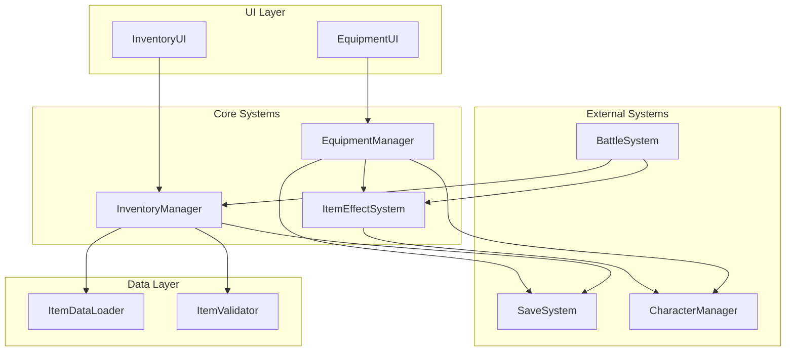

# 設計書

## 概要

インベントリ・装備システムは、プレイヤーがアイテムを管理し、キャラクターに装備を付与することで戦略性を高める機能を提供します。本システムは以下の主要コンポーネントで構成されます：

- **InventoryManager**: アイテムの保管・管理
- **EquipmentManager**: キャラクターへの装備品の着脱管理
- **ItemEffectSystem**: アイテム効果の適用・管理
- **InventoryUI**: インベントリ画面の表示・操作
- **EquipmentUI**: 装備画面の表示・操作

本システムは既存の戦闘システム、セーブ・ロードシステムと連携し、ゲーム全体の戦略性を向上させます。

## アーキテクチャ

### システム構成図



### レイヤー構成

1. **UI Layer**: ユーザーインターフェース
   - InventoryUI: インベントリ画面
   - EquipmentUI: 装備画面

2. **Core Systems**: コアロジック
   - InventoryManager: インベントリ管理
   - EquipmentManager: 装備管理
   - ItemEffectSystem: アイテム効果管理

3. **Data Layer**: データ管理
   - ItemDataLoader: アイテムデータ読み込み
   - ItemValidator: データ検証

4. **External Systems**: 外部システム連携
   - BattleSystem: 戦闘システム
   - SaveSystem: セーブ・ロード
   - CharacterManager: キャラクター管理

## コンポーネントとインターフェース

### 1. InventoryManager

インベントリの管理を担当するコアコンポーネント。

```typescript
interface InventoryManager {
  // アイテム追加
  addItem(item: Item, quantity: number): boolean;
  
  // アイテム削除
  removeItem(itemId: string, quantity: number): boolean;
  
  // アイテム使用
  useItem(itemId: string, targetCharacterId?: string): boolean;
  
  // アイテム取得
  getItem(itemId: string): Item | null;
  
  // 全アイテム取得
  getAllItems(): InventorySlot[];
  
  // アイテム数取得
  getItemCount(itemId: string): number;
  
  // 空きスロット数取得
  getAvailableSlots(): number;
  
  // インベントリ満杯チェック
  isFull(): boolean;
  
  // アイテムソート
  sortItems(sortType: ItemSortType): void;
  
  // インベントリクリア
  clear(): void;
}
```

### 2. EquipmentManager

キャラクターの装備管理を担当するコンポーネント。

```typescript
interface EquipmentManager {
  // 装備装着
  equipItem(characterId: string, item: Equipment, slot: EquipmentSlotType): boolean;
  
  // 装備解除
  unequipItem(characterId: string, slot: EquipmentSlotType): Equipment | null;
  
  // 装備取得
  getEquipment(characterId: string, slot: EquipmentSlotType): Equipment | null;
  
  // 全装備取得
  getAllEquipment(characterId: string): EquipmentSet;
  
  // 装備可能チェック
  canEquip(characterId: string, item: Equipment): boolean;
  
  // 装備条件チェック
  checkEquipmentRequirements(characterId: string, item: Equipment): EquipmentCheckResult;
  
  // 装備効果適用
  applyEquipmentEffects(characterId: string): void;
  
  // 装備効果除去
  removeEquipmentEffects(characterId: string, slot: EquipmentSlotType): void;
}
```

### 3. ItemEffectSystem

アイテム効果の適用・管理を担当するコンポーネント。

```typescript
interface ItemEffectSystem {
  // 効果適用
  applyEffect(effect: ItemEffect, targetCharacterId: string): boolean;
  
  // 効果除去
  removeEffect(effectId: string, targetCharacterId: string): boolean;
  
  // 一時効果管理
  updateTemporaryEffects(deltaTime: number): void;
  
  // 効果取得
  getActiveEffects(characterId: string): ItemEffect[];
  
  // 効果計算
  calculateEffectValue(effect: ItemEffect, character: Character): number;
  
  // 効果検証
  validateEffect(effect: ItemEffect): boolean;
}
```

### 4. ItemDataLoader

アイテムデータの読み込みと検証を担当するコンポーネント。

```typescript
interface ItemDataLoader {
  // データ読み込み
  loadItemData(filePath: string): Promise<ItemData[]>;
  
  // データ検証
  validateItemData(data: unknown): ItemData[];
  
  // アセット読み込み
  loadItemAssets(itemIds: string[]): Promise<void>;
  
  // データ取得
  getItemDefinition(itemId: string): ItemDefinition | null;
  
  // 全データ取得
  getAllItemDefinitions(): ItemDefinition[];
}
```

### 5. InventoryUI

インベントリ画面の表示と操作を担当するUIコンポーネント。

```typescript
interface InventoryUI {
  // 画面表示
  show(): void;
  
  // 画面非表示
  hide(): void;
  
  // アイテム表示更新
  updateItemDisplay(): void;
  
  // アイテム選択
  selectItem(itemId: string): void;
  
  // アクションメニュー表示
  showActionMenu(itemId: string): void;
  
  // ソート実行
  sortItems(sortType: ItemSortType): void;
  
  // ドラッグ&ドロップ処理
  handleDragDrop(fromSlot: number, toSlot: number): void;
  
  // キーボード入力処理
  handleKeyboardInput(key: string): void;
}
```

### 6. EquipmentUI

装備画面の表示と操作を担当するUIコンポーネント。

```typescript
interface EquipmentUI {
  // 画面表示
  show(characterId: string): void;
  
  // 画面非表示
  hide(): void;
  
  // 装備表示更新
  updateEquipmentDisplay(characterId: string): void;
  
  // スロット選択
  selectSlot(slot: EquipmentSlotType): void;
  
  // 装備可能アイテム一覧表示
  showEquippableItems(slot: EquipmentSlotType): void;
  
  // 能力値比較表示
  showStatComparison(currentEquipment: Equipment | null, newEquipment: Equipment): void;
  
  // プレビュー表示
  showEquipmentPreview(equipment: Equipment): void;
}
```

## データモデル

### Item（アイテム基底型）

```typescript
interface Item {
  id: string;                    // アイテムID
  name: string;                  // アイテム名
  description: string;           // 説明
  type: ItemType;                // アイテム種類
  rarity: ItemRarity;            // レアリティ
  iconPath: string;              // アイコン画像パス
  maxStack: number;              // 最大スタック数
  sellPrice: number;             // 売却価格
  buyPrice: number;              // 購入価格
}

type ItemType = 'weapon' | 'armor' | 'accessory' | 'consumable' | 'material' | 'key';
type ItemRarity = 'common' | 'uncommon' | 'rare' | 'epic' | 'legendary';
```

### Equipment（装備品）

```typescript
interface Equipment extends Item {
  type: 'weapon' | 'armor' | 'accessory';
  slot: EquipmentSlotType;       // 装備スロット
  stats: EquipmentStats;         // 能力値ボーナス
  requirements: EquipmentRequirements; // 装備条件
  durability: number;            // 耐久度
  maxDurability: number;         // 最大耐久度
  effects: ItemEffect[];         // 装備効果
}

type EquipmentSlotType = 'weapon' | 'armor' | 'accessory1' | 'accessory2';

interface EquipmentStats {
  hp?: number;
  mp?: number;
  attack?: number;
  defense?: number;
  speed?: number;
  accuracy?: number;
  evasion?: number;
}

interface EquipmentRequirements {
  level?: number;                // 必要レベル
  job?: string;                  // 必要職業
  stats?: Partial<EquipmentStats>; // 必要能力値
}
```

### Consumable（消耗品）

```typescript
interface Consumable extends Item {
  type: 'consumable';
  consumableType: ConsumableType;
  effects: ItemEffect[];         // 使用効果
  usableInBattle: boolean;       // 戦闘中使用可能
  targetType: TargetType;        // 対象タイプ
}

type ConsumableType = 'healing' | 'buff' | 'debuff' | 'cure' | 'revive';
type TargetType = 'self' | 'single' | 'all' | 'area';
```

### ItemEffect（アイテム効果）

```typescript
interface ItemEffect {
  id: string;                    // 効果ID
  type: EffectType;              // 効果タイプ
  target: EffectTarget;          // 効果対象
  value: number;                 // 効果値
  duration: number;              // 持続時間（ターン数、0=永続）
  isPermanent: boolean;          // 永続効果フラグ
  stackable: boolean;            // 重複可能フラグ
}

type EffectType = 
  | 'stat_boost'                 // 能力値上昇
  | 'stat_reduction'             // 能力値減少
  | 'hp_recovery'                // HP回復
  | 'mp_recovery'                // MP回復
  | 'status_cure'                // 状態異常回復
  | 'status_inflict'             // 状態異常付与
  | 'damage'                     // ダメージ
  | 'shield';                    // シールド

type EffectTarget = 'hp' | 'mp' | 'attack' | 'defense' | 'speed' | 'accuracy' | 'evasion' | 'status';
```

### InventorySlot（インベントリスロット）

```typescript
interface InventorySlot {
  slotIndex: number;             // スロット番号
  item: Item | null;             // アイテム
  quantity: number;              // 数量
  isEmpty: boolean;              // 空きスロットフラグ
}
```

### EquipmentSet（装備セット）

```typescript
interface EquipmentSet {
  weapon: Equipment | null;
  armor: Equipment | null;
  accessory1: Equipment | null;
  accessory2: Equipment | null;
}
```

### InventoryData（インベントリデータ）

```typescript
interface InventoryData {
  slots: InventorySlot[];        // スロット配列
  maxSlots: number;              // 最大スロット数
  usedSlots: number;             // 使用中スロット数
  gold: number;                  // 所持金
}
```

### ItemDefinition（アイテム定義）

```typescript
interface ItemDefinition {
  id: string;
  baseItem: Item;
  equipmentData?: Equipment;
  consumableData?: Consumable;
  dropRate?: number;             // ドロップ率
  obtainableFrom?: string[];     // 入手元
}
```

## 正確性プロパティ

*プロパティとは、システムの全ての有効な実行において真であるべき特性や振る舞いのことです。プロパティは人間が読める仕様と機械で検証可能な正確性保証の橋渡しとなります。*

### プロパティ1: インベントリ容量制限

*任意の*アイテム追加操作後、インベントリ内のアイテム総数は100以下でなければならない

**検証要件: 1.1**

### プロパティ2: アイテム追加の正確性

*任意の*有効なアイテムをインベントリに追加した後、そのアイテムがインベントリ内に存在し、数量が正しく反映される

**検証要件: 1.2**

### プロパティ3: 満杯時の追加拒否

*任意の*満杯状態のインベントリに対するアイテム追加試行は拒否され、インベントリの状態は変更されない

**検証要件: 1.3**

### プロパティ4: アイテム削除の正確性

*任意の*インベントリ内のアイテムを削除した後、そのアイテムがインベントリから消えるか、数量が正しく減少する

**検証要件: 1.4**

### プロパティ5: ソート後の順序保証

*任意の*インベントリをアイテム種類でソートした後、同じ種類のアイテムが連続して配置される

**検証要件: 1.5**

### プロパティ6: アイテム情報の正確性

*任意の*インベントリ内のアイテムについて、取得した詳細情報（名前、説明、効果、数量）がアイテム定義と一致する

**検証要件: 1.6**

### プロパティ7: 装備スロットの存在保証

*任意の*キャラクターは、武器スロット1つ、防具スロット1つ、アクセサリスロット2つを持つ

**検証要件: 2.1, 2.2, 2.3**

### プロパティ8: 装備効果の適用と除去

*任意の*装備品をキャラクターに装着した後、キャラクターの能力値が装備の効果分だけ変化し、装備を解除すると元の能力値に戻る

**検証要件: 2.4, 2.5, 3.1**

### プロパティ9: 装備入れ替えの正確性

*任意の*装備スロットに既に装備がある状態で新しい装備を装着すると、古い装備がインベントリに戻り、新しい装備が装着される

**検証要件: 2.6**

### プロパティ10: 装備条件チェック

*任意の*装備条件（レベル、職業）を満たさないキャラクターによる装備試行は拒否され、装備状態は変更されない

**検証要件: 2.7, 4.3, 4.4**

### プロパティ11: 消耗品使用の効果と消費

*任意の*消耗品を使用した後、効果が適用され、アイテムの数量が1減少する（または削除される）

**検証要件: 3.2**

### プロパティ12: 回復アイテムの効果

*任意の*回復アイテムを使用した後、対象キャラクターのHP/MPが増加する（最大値を超えない）

**検証要件: 3.3**

### プロパティ13: バフアイテムの効果

*任意の*バフアイテムを使用した後、対象キャラクターの能力値が一時的に上昇する

**検証要件: 3.4**

### プロパティ14: 状態異常回復の効果

*任意の*状態異常回復アイテムを使用した後、対象キャラクターの指定された状態異常が解除される

**検証要件: 3.5**

### プロパティ15: 一時効果の時間管理

*任意の*一時効果は、指定された持続時間（ターン数）が経過した後に自動的に解除される

**検証要件: 3.6**

### プロパティ16: 装備条件の視覚的識別

*任意の*装備条件を満たさないアイテムは、UI上で正しく識別され、装備可能なアイテムと区別される

**検証要件: 4.5**

### プロパティ17: データスキーマ検証

*任意の*不正なアイテムデータは、スキーマ検証によって拒否される

**検証要件: 5.2**

### プロパティ18: ドラッグ&ドロップによる並び替え

*任意の*2つのインベントリスロット間でドラッグ&ドロップを実行すると、アイテムの位置が正しく入れ替わる

**検証要件: 6.6**

### プロパティ19: 戦闘中のアイテム使用

*任意の*戦闘中に使用可能なアイテムを使用すると、効果が即座に適用され、キャラクターのターンが消費される

**検証要件: 8.2, 8.3**

### プロパティ20: 装備効果の戦闘連携

*任意の*装備品の効果は、戦闘中の能力値計算（ダメージ、命中率等）に正しく反映される

**検証要件: 8.4**

### プロパティ21: 装備耐久度の減少

*任意の*戦闘で装備品を使用すると、装備品の耐久度が減少する

**検証要件: 8.5**

### プロパティ22: インベントリのセーブ・ロード

*任意の*インベントリ状態をセーブしてロードすると、全てのアイテムと数量が正確に復元される

**検証要件: 9.1, 9.3**

### プロパティ23: 装備状態のセーブ・ロード

*任意の*キャラクターの装備状態をセーブしてロードすると、全ての装備スロットの状態が正確に復元される

**検証要件: 9.2, 9.4**

### プロパティ24: 不正操作の拒否

*任意の*不正なアイテム操作（存在しないアイテムの使用、無効なスロットへのアクセス等）は拒否され、システムの状態は変更されない

**検証要件: 10.2**

### プロパティ25: 装備失敗時の状態保持

*任意の*装備装着の失敗時、キャラクターの装備状態とインベントリの状態は変更されない

**検証要件: 10.3**

## エラーハンドリング

### エラー分類

1. **データエラー**
   - アイテムデータの読み込み失敗
   - スキーマ検証エラー
   - 不正なアイテムID参照

2. **操作エラー**
   - インベントリ満杯時の追加試行
   - 装備条件不一致
   - 存在しないアイテムへのアクセス

3. **システムエラー**
   - LocalStorageアクセス失敗
   - アセット読み込み失敗
   - メモリ不足

### エラー処理戦略

```typescript
interface ErrorHandler {
  // エラーログ記録
  logError(error: InventoryError): void;
  
  // ユーザーへの通知
  notifyUser(message: string, severity: ErrorSeverity): void;
  
  // 安全な状態への復帰
  recoverToSafeState(): void;
  
  // デフォルト値の使用
  useDefaultValue<T>(key: string): T;
}

type ErrorSeverity = 'info' | 'warning' | 'error' | 'critical';

interface InventoryError {
  code: string;
  message: string;
  severity: ErrorSeverity;
  context?: Record<string, unknown>;
  timestamp: number;
}
```

### エラー回復手順

1. **データエラー**: デフォルトアイテムデータを使用
2. **操作エラー**: 操作を拒否し、ユーザーに通知
3. **システムエラー**: 安全な状態に復帰し、エラーログを記録

## テスト戦略

### デュアルテストアプローチ

本システムでは、ユニットテストとプロパティベーステストの両方を使用します：

- **ユニットテスト**: 特定の例、エッジケース、エラー条件を検証
- **プロパティテスト**: 普遍的なプロパティを全ての入力に対して検証

両者は補完的であり、包括的なカバレッジを実現します。

### ユニットテストのバランス

- ユニットテストは特定の例とエッジケースに焦点を当てる
- プロパティテストが多数の入力をカバーするため、過度なユニットテストは避ける
- ユニットテストの焦点:
  - 特定の動作を示す例
  - コンポーネント間の統合ポイント
  - エッジケースとエラー条件

### プロパティテスト設定

- 各プロパティテストは最低100回の反復を実行
- 各テストは設計書のプロパティを参照
- タグ形式: **Feature: inventory-equipment-system, Property {番号}: {プロパティテキスト}**

### テストカバレッジ

1. **インベントリ管理**
   - アイテム追加・削除・使用
   - 容量制限
   - ソート機能

2. **装備システム**
   - 装備装着・解除
   - 装備条件チェック
   - 装備効果適用

3. **アイテム効果**
   - 能力値変更
   - 回復効果
   - 一時効果管理

4. **データ永続化**
   - セーブ・ロード
   - データ整合性

5. **エラーハンドリング**
   - 不正操作の拒否
   - エラー回復

6. **パフォーマンス**
   - 表示速度
   - 操作レスポンス
   - メモリ使用量

