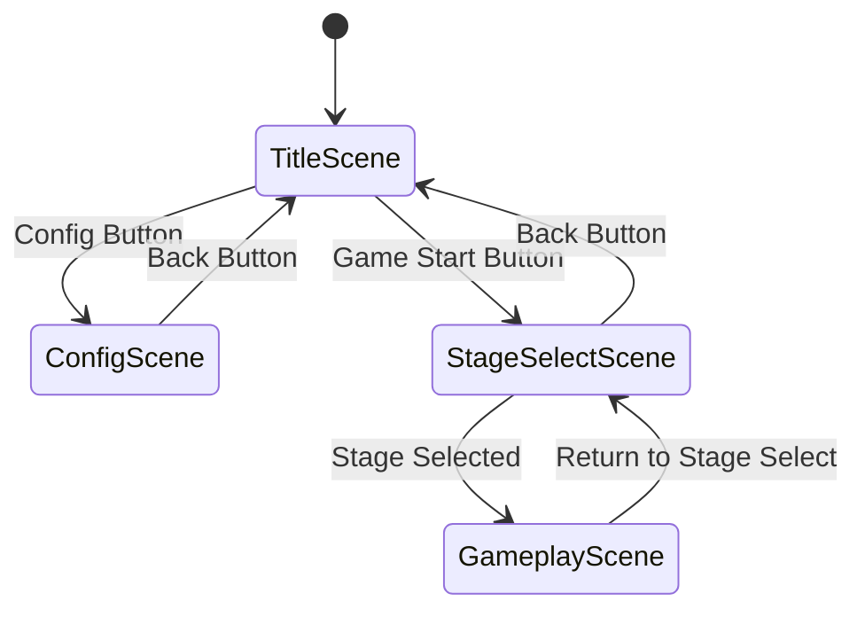

# Design Document

## Overview

The title menu screen system consists of three main scenes: TitleScene, ConfigScene, and StageSelectScene. This design follows Phaser 3's scene-based architecture and implements a state machine pattern for navigation flow. The system provides a polished entry point for the game with smooth transitions and responsive user interface elements.

## Architecture

### Scene Flow Diagram



### Core Components

1. **TitleScene**: Main entry point with game branding and navigation
2. **ConfigScene**: Settings and configuration options (mock implementation)
3. **StageSelectScene**: Stage selection interface
4. **MenuButton**: Reusable button component with hover effects
5. **SceneTransition**: Smooth transition effects between scenes

## Components and Interfaces

### TitleScene Class

```typescript
export class TitleScene extends Phaser.Scene {
  private gameTitle: Phaser.GameObjects.Text;
  private startButton: MenuButton;
  private configButton: MenuButton;
  private background: Phaser.GameObjects.Image;

  constructor() {
    super({ key: 'TitleScene' });
  }

  preload(): void {
    // Load title screen assets
  }

  create(): void {
    // Setup UI elements and event handlers
  }

  private handleGameStart(): void {
    // Transition to stage select
  }

  private handleConfig(): void {
    // Transition to config scene
  }
}
```

### ConfigScene Class

```typescript
export interface ConfigOptions {
  masterVolume: number;
  sfxVolume: number;
  musicVolume: number;
  fullscreen: boolean;
  keyBindings: KeyBindings;
}

export class ConfigScene extends Phaser.Scene {
  private configOptions: ConfigOptions;
  private volumeSliders: VolumeSlider[];
  private backButton: MenuButton;

  constructor() {
    super({ key: 'ConfigScene' });
  }

  create(): void {
    // Setup mock configuration UI
  }

  private handleBack(): void {
    // Return to title scene
  }
}
```

### StageSelectScene Class

```typescript
export interface StageData {
  id: string;
  name: string;
  description: string;
  isUnlocked: boolean;
  thumbnail?: string;
}

export class StageSelectScene extends Phaser.Scene {
  private stageButtons: StageButton[];
  private backButton: MenuButton;
  private stageData: StageData[];

  constructor() {
    super({ key: 'StageSelectScene' });
  }

  create(): void {
    // Setup stage selection grid
  }

  private loadStageData(): void {
    // Load available stages from JSON
  }

  private handleStageSelect(stageId: string): void {
    // Transition to gameplay scene
  }
}
```

### MenuButton Component

```typescript
export class MenuButton extends Phaser.GameObjects.Container {
  private background: Phaser.GameObjects.Rectangle;
  private text: Phaser.GameObjects.Text;
  private isHovered: boolean = false;

  constructor(scene: Phaser.Scene, x: number, y: number, text: string, callback: () => void) {
    super(scene, x, y);
    this.setupButton(text, callback);
  }

  private setupButton(text: string, callback: () => void): void {
    // Create button visuals and interaction
  }

  private onHover(): void {
    // Hover animation
  }

  private onOut(): void {
    // Unhover animation
  }
}
```

## Data Models

### Stage Configuration

```json
{
  "stages": [
    {
      "id": "stage-001",
      "name": "Forest Path",
      "description": "A peaceful introduction to the world",
      "isUnlocked": true,
      "thumbnail": "assets/thumbnails/forest-path.png",
      "difficulty": 1
    },
    {
      "id": "stage-002", 
      "name": "Mountain Pass",
      "description": "Treacherous terrain awaits",
      "isUnlocked": false,
      "thumbnail": "assets/thumbnails/mountain-pass.png",
      "difficulty": 2
    }
  ]
}
```

### Configuration Data

```json
{
  "defaultConfig": {
    "audio": {
      "masterVolume": 0.8,
      "sfxVolume": 0.7,
      "musicVolume": 0.6
    },
    "graphics": {
      "fullscreen": false,
      "resolution": "1920x1080",
      "quality": "high"
    },
    "controls": {
      "keyBindings": {
        "up": "W",
        "down": "S", 
        "left": "A",
        "right": "D",
        "action": "SPACE",
        "menu": "ESC"
      }
    }
  }
}
```

## Error Handling

### Scene Transition Errors

- **Missing Scene**: Graceful fallback to title screen if target scene fails to load
- **Asset Loading**: Display loading indicator and retry mechanism for failed assets
- **Invalid Stage**: Show error message and return to stage select if stage data is corrupted

### Input Handling

- **Keyboard Navigation**: Ensure focus management works correctly across all browsers
- **Touch Support**: Provide fallback for mobile devices without hover states
- **Accessibility**: Support screen readers and keyboard-only navigation

### Error Recovery

```typescript
export class ErrorHandler {
  static handleSceneTransitionError(fromScene: string, toScene: string, error: Error): void {
    console.error(`Failed to transition from ${fromScene} to ${toScene}:`, error);
    // Fallback to title scene
    this.scene.start('TitleScene');
  }

  static handleAssetLoadError(assetKey: string, error: Error): void {
    console.warn(`Failed to load asset ${assetKey}:`, error);
    // Use placeholder asset or skip non-critical assets
  }
}
```

## Testing Strategy

### Unit Tests

- **MenuButton Component**: Test hover states, click handlers, and visual feedback
- **Scene Transitions**: Verify correct scene switching and data passing
- **Configuration Persistence**: Test saving and loading of mock config data
- **Stage Data Loading**: Validate JSON parsing and error handling

### Integration Tests

- **Complete Navigation Flow**: Test full user journey from title to gameplay
- **Keyboard Navigation**: Verify all menu options are accessible via keyboard
- **Responsive Design**: Test UI scaling across different screen sizes
- **Performance**: Ensure smooth 60fps during transitions and animations

### Visual Tests

- **UI Layout**: Screenshot comparison tests for consistent visual appearance
- **Animation Timing**: Verify transition durations meet 500ms requirement
- **Hover Effects**: Test button feedback across different input methods

### Test Data

```typescript
export const mockStageData: StageData[] = [
  {
    id: 'test-stage-1',
    name: 'Test Stage 1',
    description: 'First test stage',
    isUnlocked: true
  },
  {
    id: 'test-stage-2', 
    name: 'Test Stage 2',
    description: 'Second test stage',
    isUnlocked: false
  }
];

export const mockConfigData: ConfigOptions = {
  masterVolume: 0.5,
  sfxVolume: 0.5,
  musicVolume: 0.5,
  fullscreen: false,
  keyBindings: {
    up: 'W',
    down: 'S',
    left: 'A', 
    right: 'D',
    action: 'SPACE',
    menu: 'ESC'
  }
};
```

## Performance Considerations

### Asset Management

- **Preloading**: Load all menu assets during initial game load
- **Texture Atlasing**: Combine UI elements into sprite sheets
- **Audio Optimization**: Use compressed audio formats for menu sounds

### Memory Management

- **Scene Cleanup**: Properly destroy unused scenes and assets
- **Event Listeners**: Remove event listeners when scenes are destroyed
- **Texture Caching**: Reuse common UI textures across scenes

### Rendering Optimization

- **Static Elements**: Use static rendering for non-animated UI elements
- **Batch Rendering**: Group similar UI elements for efficient rendering
- **Culling**: Hide off-screen elements during transitions
